# Learn Next.js
{: .no_toc }

Next.js는 React 기반의 프레임워크로, 서버 사이드 렌더링, 스태틱 사이트 생성, 그리고 웹 애플리케이션 최적화를 위한 다양한 기능을 제공합니다.

이 글에서는 Next.js를 이용해 간단한 금융 대시보드 페이지를 만드는 과정을 설명합니다.

# 목차
{: .no_toc .text-delta }

1. TOC
{:toc}

---

# 글 요약

제작할 웹 어플리케이션은 다음과 같은 기능을 가지고 있습니다.

* **공개 홈페이지**: 모든 사용자가 접근할 수 있는 홈 페이지입니다.
* **로그인 페이지**: 사용자 인증을 위한 로그인 페이지입니다.
* **인증에 의해 보호되는 대시보드 페이지**: 인증된 사용자만 접근할 수 있는 대시보드 페이지들입니다.
* **CRUD**: 사용자가 금융 정보를 관리할 수 있는 기능입니다.
* **데이터베이스**: 애플리케이션의 데이터를 관리하는 데이터베이스 설정입니다.


# 시작하기 전

이 과정은 React 및 JavaScript에 대한 기본적인 이해를 가정합니다.

참고자료 : [Learn Next.js](https://nextjs.org/learn/dashboard-app)

---

# 프로젝트 생성하기

sample next.js application 만들기

```shell
npx create-next-app@latest nextjs-dashboard --use-npm --example "https://github.com/vercel/next-learn/tree/main/dashboard/starter-example"
```

## 프로젝트 내용 이해하기

**폴더 구조**

- `/app`: 애플리케이션의 라우트, 컴포넌트, 로직을 포함하며, 주로 작업할 폴더입니다.
- `/app/lib`: 재사용 가능한 유틸리티 함수와 데이터 페칭 함수 등, 애플리케이션에서 사용되는 함수들 입니다.
- `/app/ui`: 카드, 테이블, 폼 등 애플리케이션의 UI 컴포넌트를 담고있는 디렉토리 입니다.
- `/public`: 이미지와 같은 애플리케이션의 정적 페이지를 구성할 리소스 입니다.
- `/scripts`: 데이터베이스 관련 디렉토리입니다.
- `설정 파일`: next.config.js에 nextjs 설정파일을 구성할 수 있습니다.

**플레이스홀더 데이터**

데이터베이스나 API를 아직 사용하지 않다면 플레이스홀더 데이터를 이용해 미리 데이터를 구성할 수 있습니다.
이 프로젝트에서는 `app/lib/placeholder-data.js`에 플레이스홀더 데이터를 구성했습니다.

# 개발 프로젝스 실행하기

프로젝트는 typescript로 작성되었습니다.

프로젝트의 패키지를 설치하고 시작합니다.

```shell
npm i
npm run dev
```

# CSS 스타일링 방법

## 글로벌 스타일

프로젝트 내에 있는 `/app/ui/global.css`을 사용하여 애플리케이션 전체에 공통적으로 적용되는 CSS 규칙을 정의할 수 있습니다.

## 글로벌 스타일 적용

어플리케이션 최상위 컴포넌트에 적용해야 합니다. next.js에서는 루트 레이아웃이라고 부릅니다.

`/app/layout.tsx`에 해당 global.css를 임포트 해오는 과정을 아래와 같이 추가합니다. 이렇게 적용하면 애플리케이션의 모든 컴포넌트와 페이지에 적용되게 됩니다.

```typescript
import '@/app/ui/global.css';
import React from "react";
 
export default function RootLayout({
  children,
}: {
  children: React.ReactNode;
}) {
  return (
    <html lang="en">
      <body>{children}</body>
    </html>
  );
}
```

## `/app/layout.tsx` 상세 설명

루트레이아웃은 애플리케이션의 최상위 구조를 설정하며, 모든 페이지와 컴포넌트는 이 레이아웃 내에서 렌더링됩니다.

**RootLayout 함수 컴포넌트 정의**

- **props** : { children }: { children: React.ReactNode; }
  - children의 타입을 정의해주었습니다. // React.ReactNode는 렌더링 될 수 있는 거의 모든 종류의 React 노드 ( 텍스트, HTML , 다른 컴포넌트 )를 포함할 수 있는 타입
- **return** : <html> 요소를 반환하며, 내부 <body> 태그 내에는 children이 렌더링 되는데, 앞서 RootLayout을 사용하여 래핑된 모든 자식 컴포넌트를 의미합니다.

## 글로벌 스타일 결과 확인

앞서 local에 생성한 주소에서 글로벌 스타일이 적용되었는지 확인해봅니다.

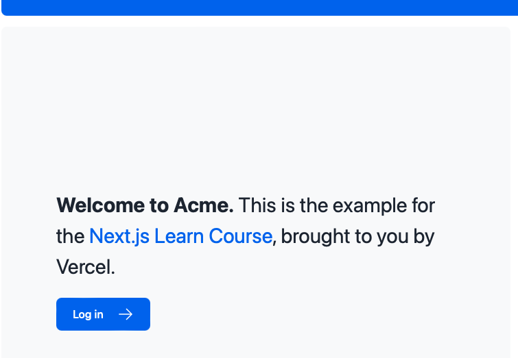

## Tailwind CSS

Tailwind CSS는 유틸리티 클래스를 직접 TSX 마크업에 빠르게 작성할 수 있도록 해주는 CSS 프레임워크입니다.

# 사용자 정의 폰트와 이미지 추가하기

Next.js는 next/font 모듈을 사용하여 폰트를 자동으로 최적화합니다. 

## 사용자 정의 폰트 추가 방법

- `/app/ui` 폴더에 fonts.ts 파일을 생성합니다.
- 아래와 같이 코드를 구성합니다. subsets 은 폰트 모듈에서 제공하는 폰트 스타일 입니다.

```typescript
import { Inter } from 'next/font/google';

export const inter = Inter({ subsets: ['latin'] });
```

### 사용자 정의 폰트 글로벌 적용

- `/app/layout.tsx` 파일에서 이 폰트를 <body> 요소에 추가합니다.

```typescript
import '@/app/ui/global.css';
import { inter } from '@/app/ui/fonts';

export default function RootLayout({
                                     children,
                                   }: {
  children: React.ReactNode;
}) {
  return (
      <html lang="en">
          <body className={`${inter.className} antialiased`}>{children}</body>
      </html>
);
}
```

### 코드 상세 설명

- **${inter.className}** : Inter 폰트를 적용하기 위한 'next/font' 모듈이 제공하는 클래스 이름을 동적으로 할당합니다.
- **antialiased** : 폰트의 가장자리를 부드럽게 처리해주는 클래스입니다.

### 브라우저에서 확인

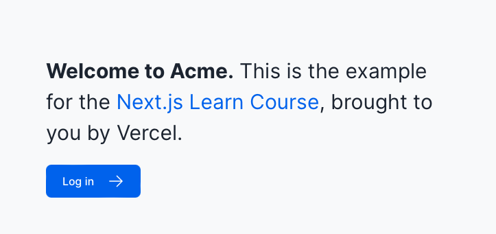

## 이미지 추가와 최적화

페이지에 구체적인 이미지를 추가해야할 경우가 있습니다. 각 페이지는 다를 수 있기 때문에 구체적인 각각의 구성요소는 해당 페이지의 컴포넌트 파일에서 직접관리합니다.

따라서 최초 홈 페이지를 정의하고 있는 /app/page.tsx 파일에서 이미지를 추가하는 과정이 필요합니다.

### page.tsx 구성하기

- **next/image 컴포넌트 임포트:** 
next/image 컴포넌트를 사용하면 이미지를 자동으로 최적화하고, 뷰포트에 맞게 크기를 조정할 수 있습니다.

```typescript
import Image from 'next/image';
```

- **이미지 추가:** 특정 클래스를 사용하여 `app/page.tsx` 파일에 데스크탑 화면에서만 표시되도록 추가

```typescript
import AcmeLogo from '@/app/ui/acme-logo';
import { ArrowRightIcon } from '@heroicons/react/24/outline';
import Link from 'next/link';
import { lusitana } from '@/app/ui/fonts';
import Image from 'next/image';

export default function Page() {
  return (
          // ...
          <div className="flex items-center justify-center p-6 md:w-3/5 md:px-28 md:py-12">
                  {/* Add Hero Images Here */}
                  <Image
  src="/hero-desktop.png"
  width={1000}
  height={760}
  className="hidden md:block"
  alt="Screenshots of the dashboard project showing desktop version"
          />
          </div>
  //...
);
}
```

### 코드 상세설명

- **src** : /public 내 위치한 이미지를 참조합니다.
- **className="hidden md:block"** : Tailwind CSS 사용하여 데스크탑 화면에서만 이미지가 표시되도록 하고(md:block) 모바일 화면에서는 숨깁니다.(hidden)

### 브라우저 확인

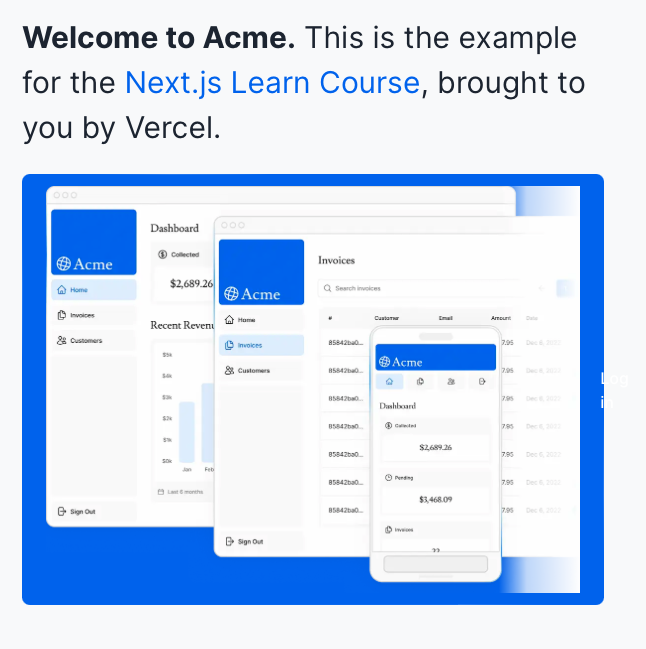

# 페이지와 레이아웃 만들기

next.js의 layout.tsx는 공통 스타일 적용 외에도 특정 페이지 그룹간에 공통된 UI를 공유하는 목적으로 사용될 수 있습니다.

### page.tsx

* **page.tsx 파일**: 특정 경로에 대한 UI를 렌더링하는 React 컴포넌트를 자동으로 구성할 수 있게 해주는 파일입니다.
  예를 들어, /app/page.tsx는 애플리케이션의 홈 페이지(/)에 해당하는 컴포넌트를 정의합니다. 이 파일을 페이지 렌러링을 위한 필수 파일입니다.

## 대시보드 페이지 생성

공통적으로 사용되는 사이드 네비게이션 같은 구성요소를 만들 수 있습니다.

Next.js에서는 파일 시스템 기반 라우팅을 사용하여 애플리케이션의 페이지와 경로를 구성합니다. 
이 방식은 디렉토리와 파일구조를 통해 자동으로 라우트를 생성하고 관리할 수 있게 해주며, 
개발자가 명시적으로 라우팅 로직을 작성할 필요를 줄여줍니다.

### 중첩 라우트 생성 방법

단순히 디렉토리를 중첩하여 구성하고 각 디렉토리 안에 page.tsx 파일을 추가하면 됩니다.

```shell
/app
  /ui
    /dashboard
      page.tsx
```

`/app/ui/dashboard/page.tsx`파일은 /dashboard 라우트와 연결되며, 해당 경로는 http://localhost:3000/ui/dashboard 가 됩니다.

파일 시스템 기반 라우팅은 URL 경로와 애플리케이션의 파일 구조가 일치하도록 함으로써, 
명확한 프로젝트 구조를 유지할 수 있도록 합니다.

### layout.tsx

* **layout.tsx 파일**: 특정 섹션 또는 페이지 그룹에 공통적으로 적용되는 레이아웃을 정의하는데 사용됩니다.
예를 들어, header 혹은 navigation-bar 와 같은 반복되는 UI를 재사용하기 위해 사용됩니다.

### 대시보드 레이아웃 구성하기

대시보드 관련 페이지들에 공통적으로 적용되는 UI를 가진 `/app/ui/dashboard/layout.tsx`를 만들 수 있습니다.

```typescript
import SideNav from '@/app/ui/dashboard/sidenav';

export default function Layout({ children }: { children: React.ReactNode }) {
    return (
        <div className="flex h-screen flex-col md:flex-row md:overflow-hidden">
            <div className="w-full flex-none md:w-64">
                <SideNav />
            </div>
            <div className="flex-grow p-6 md:overflow-y-auto md:p-12">{children}</div>
        </div>
    );
}
```

### 대시보드 레이아웃 코드 상세설명

- **{ children }: { children: React.ReactNode }:** Layout 함수 컴포넌트는 React.ReactNode를 통해 내부 컨텐츠가 무엇인지 알 필요 없이, 다양한 상황에서 해당 레이아웃에 사용될 컨텐츠를 렌더링 할 수 있습니다.

### 루트 레이아웃과 대시보드 레이아웃의 차이

루트 레이아웃은 전체 애플리케이션에 공통적인 기본 구조와 스타일을 제공하는 반면, 대시보드와 같은 특정 섹션에 대한 레이아웃은 그 섹션의 고유한 요구 사항에 맞춰 추가적인 UI 구성 요소나 스타일을 제공합니다.

## dashbaord 페이지 브라우저 확인

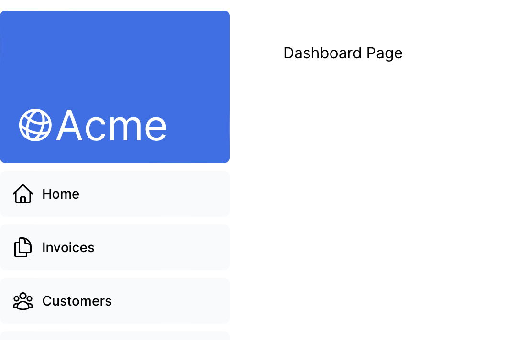

# 페이지 전환

대시보드를 만들었으니, 대시보드 경로 간에 탐색할 수 있게 하는 링크를 추가할 수 있습니다.

Next.js는 <Link /> 컴포넌트 및 usePathname hook을 통해 이를 구현할 수 있습니다.

## <Link /> 컴포넌트 사용하기

기존 페이지간 전환을 위해 HTML에서 `<a>` 태그를 사용했습니다. 
하지만 Next.js에서는 `<Link />` 컴포넌트를 사용하여 애플리케이션 내의 페이지들 사이에서 탐색을 할 수 있게 합니다. 

### <Link /> 컴포넌트 적용하기

`/app/ui/dashboard/nav-links.tsx` 에서 Link component를 import 한 후 아래와 같이 기존 `<a>` 태그 대신 `<Link>` 태그로 변경합니다.

```typescript
import {
  UserGroupIcon,
  HomeIcon,
  DocumentDuplicateIcon,
} from '@heroicons/react/24/outline';
import Link from 'next/link';

// Map of links to display in the side navigation.
// Depending on the size of the application, this would be stored in a database.
const links = [
  { name: 'Home', href: 'dashboard', icon: HomeIcon },
  {
    name: 'Invoices',
    href: 'invoices',
    icon: DocumentDuplicateIcon,
  },
  { name: 'Customers', href: 'customers', icon: UserGroupIcon },
];

export default function NavLinks() {
  return (
          <>
                  {links.map((link) => {
                      const LinkIcon = link.icon;
                      return (
                              <Link
                                      key={link.name}
                      href={link.href}
                      className="flex h-[48px] grow items-center justify-center gap-2 rounded-md bg-gray-50 p-3 text-sm font-medium hover:bg-sky-100 hover:text-blue-600 md:flex-none md:justify-start md:p-2 md:px-3"
                      >
                      <LinkIcon className="w-6" />
                      <p className="hidden md:block">{link.name}</p>
                              </Link>
                    );
                    })}
          </>
  );
}
```

### 코드 상세 설명

- 사이드 네비게이션에 표시할 링크들을 정의합니다.
  - name - 링크의 표시 이름
  - href - 탐색할 경로
  - icon은 링크 옆에 표시될 아이콘

```typescript
const links = [
  { name: 'Home', href: 'dashboard', icon: HomeIcon },
  {
    name: 'Invoices',
    href: 'invoices',
    icon: DocumentDuplicateIcon,
  },
  { name: 'Customers', href: 'customers', icon: UserGroupIcon },
];
```

- links 배열을 순회하며, 각 링크에 대한 <Link /> 컴포넌트를 렌더링합니다.

```typescript
                  {links.map((link) => {
                      const LinkIcon = link.icon;
                      return (
                              <Link
                                      key={link.name}
                                      href={link.href}
                                      className="flex h-[48px] grow items-center justify-center gap-2 rounded-md bg-gray-50 p-3 text-sm font-medium hover:bg-sky-100 hover:text-blue-600 md:flex-none md:justify-start md:p-2 md:px-3" >
                      <LinkIcon className="w-6" />
                      <p className="hidden md:block">{link.name}</p>
                              </Link>
                    );
                  }
```

### 페이지 전환 브라우저 확인

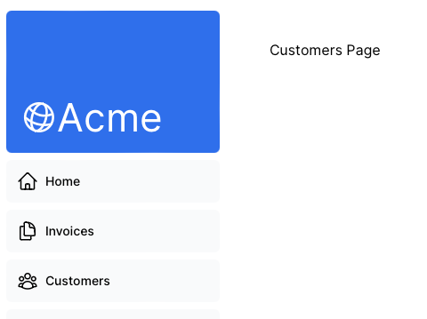

### 자동 코드 분할 및 프리패칭

* **자동 코드 분할**

React에서는 사용자가 첯음 사이트를 방문할 때 애플리케이션의 모든 코드를 한번에 다운로드 합니다.

반면에 Next.js에서는 자동 코드 분할 기능을 사용하여 사용자가 특정 페이지를 방문할 때 그 페이지에 필요한 코드만을 로드합니다. 이는 각 코드별로 다른 번들을 가지게 되며 이는 아래와 같은 장점을 가지게 됩니다.

- **빠른 초기로드** : 처음 사이트를 방문할 때 필요한 코드만 로드하기 때문에 빠르게 초기 페이지 로드가 가능합니다.
- **에러 처리** : 한 페이지에서 발생한 오류가 애플리케이션 전체에 영향을 끼치지 않습니다.

* **프리패칭**

사용자가 페이지에 방문하기 전에, 해당 페이지에 필요한 코드를 미리 로드하는 기능입니다.

- **페이지 탐색 시 빠른 반응**: <Link> 컴포넌트가 사용될 때, Next.js는 자동으로 해당 링크의 타겟 페이지에 필요한 코드를 백그라운드에서 미리 로드합니다. 사용자가 링크를 클릭하면, 이미 로드된 코드 덕분에 페이지 전환이 빠르게 이루어집니다.
- **사용자 경험**: 이 기능 덕분에 애플리케이션은 전체 페이지를 새로고침하지 않고도 빠른 페이지 전환을 제공할 수 있습니다.

## usePathname() 훅 사용하여 사용자 위치를 시각적으로 나타내기 

네비게이션에서 사용자에게 현재 위치를 알려주는 UI 패턴 입니다.
현재 페이지에 해당하는 네비게이션 링크를 다른 링크들과 구별하여 표시할 수 있도록 도와주는 usePathname() 훅을 Next.js에서는 제공합니다.

### usePathname() 훅

usePathname() 훅은 현재 브라우저의 경로(URL)를 반환해 줍니다. 이 값을 사용해 현재 위치와 네비게이션 링크의 경로를 비교함으로써, 사용자가 현재 어느 페이지에 있는지 알 수 있습니다.

### NavLink 컴포넌트를 클라이언트 컴포넌트로 만들기

usePathName() 훅은 클라이언트 사이드에서만 실행됩니다. 따라서 이 훅을 사용하는 컴포넌트는 서버 사이드 렌더링과정에서는 실행되지 않고 브라우저에서만 실행됩니다.

`dashboard/nav-links.tsx`
```typescript
'use client';
 
import {
  UserGroupIcon,
  HomeIcon,
  InboxIcon,
} from '@heroicons/react/24/outline';
import Link from 'next/link';
import { usePathname } from 'next/navigation';
 
// ...
```

### 현재 경로 확인 및 활성 링크 스타일 적용하기

pathname 변수에 현재 경로 할당하기

```typescript
export default function NavLinks() {
  const pathname = usePathname();
  // ...
}
```

스타일 적용하기

```typescript
'use client';
 
import {
  UserGroupIcon,
  HomeIcon,
  DocumentDuplicateIcon,
} from '@heroicons/react/24/outline';
import Link from 'next/link';
import { usePathname } from 'next/navigation';
import clsx from 'clsx';
 
// ...
 
export default function NavLinks() {
  const pathname = usePathname();
 
  return (
    <>
      {links.map((link) => {
        const LinkIcon = link.icon;
        return (
          <Link
            key={link.name}
            href={link.href}
            className={clsx(
              'flex h-[48px] grow items-center justify-center gap-2 rounded-md bg-gray-50 p-3 text-sm font-medium hover:bg-sky-100 hover:text-blue-600 md:flex-none md:justify-start md:p-2 md:px-3',
              {
                'bg-sky-100 text-blue-600': pathname === link.href,
              },
            )}
          >
            <LinkIcon className="w-6" />
            <p className="hidden md:block">{link.name}</p>
          </Link>
        );
      })}
    </>
  );
}
```

### 브라우저에서 확인하기

이제 경로를 변경하면 왼쪽 네비게이션 패널에 파란색으로 현재 경로의 패널에 시각적으로 표시가 됩니다.

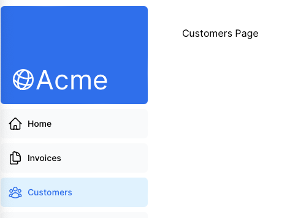

# 데이터베이스

Next.js 대시보드 를 구성하는데 사용될 PostgreSQL을 설정합니다.

## github repository 만들기

현재까지 구성한 내용을 git repository에 push 합니다.

## Vercel Account 만들기

[vercel](https://vercel.com/new/)

앞서 생성한 레포지토리와 연결해줍니다. 그 후 deploy를 클릭합니다.

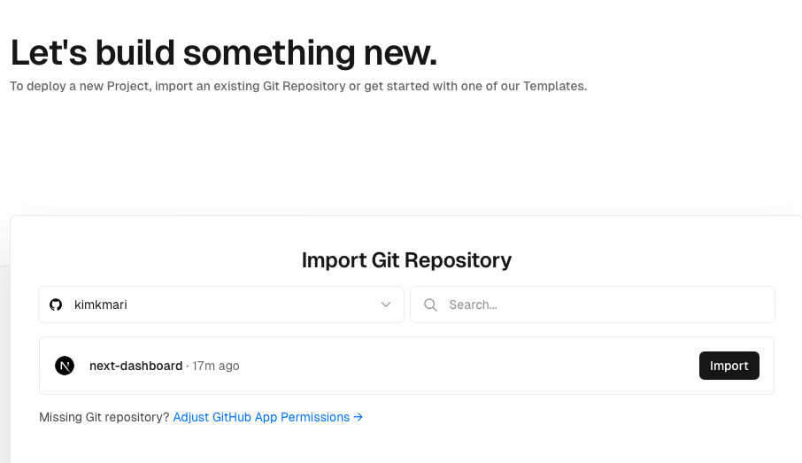

배포된 프로젝트를 확인합니다.

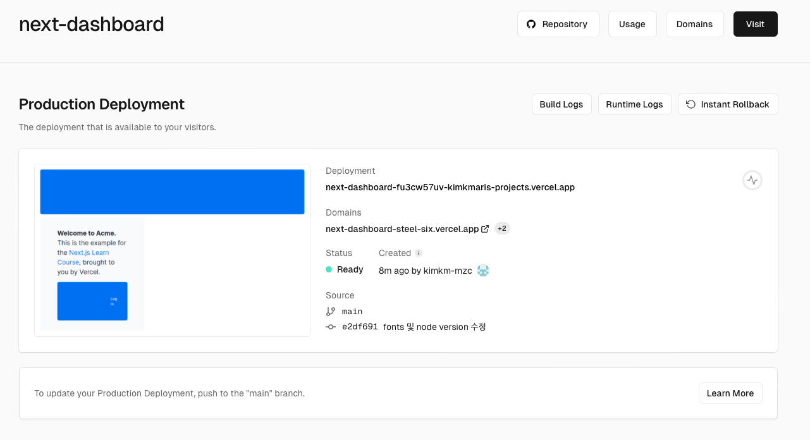

## PostgreSQL 데이터베이스 설정하기 with Vercel

1. Vercel 프로젝트 대시보드에서 Storage 탭을 선택합니다.
2. 사용가능한 저장 옵션 중에서 Postgres를 선택하고 데이터베이스를 생성합니다.
3. 생성 단계 중 지역을 선택하는 부분에서 살고있는 지역과 가장 가까운 곳으로 선택합니다. 본 블로그에서는 `Singapore sin1` 을 선택하였습니다.

참고 문서 : [자세한 설치가이드](https://nextjs.org/learn/dashboard-app/setting-up-your-database)

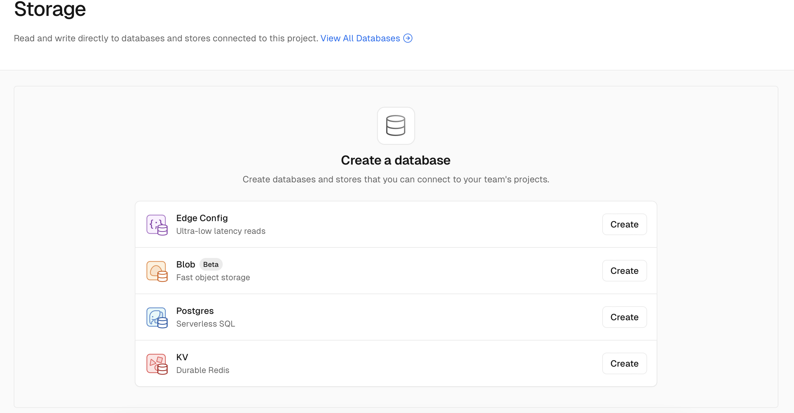

## 데이터 베이스 연결정보 확인

1. `.env.local` 탭 : 연결된 PostgreSQL 데이터베이스를 선택하여 .env.local 탭을 찾아 생성된 연결 정보를 확인합니다.

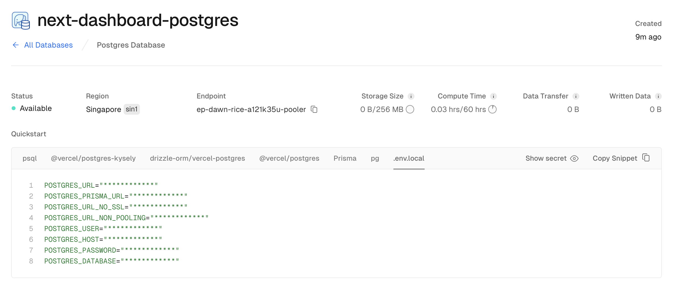

2. 소스 프로젝트에서 .env 파일을 생성한 후 앞서 생성한 데이터베이스 연결 정보를 넣어줍니다.

3. npm i @vercel/postgres 명령어를 실행하여 라이브러리를 설치합니다.

## 데이터 베이스 seeding

프로젝트의 `/scripts` 폴더 내에 `seed.js`파일이 있습니다. 해당 파일을 이용하여 생성한 데이터 베이스에 초기 데이터를 넣을 수 있습니다.

다음과 같이 package.json 파일을 수정합니다.
```json
  "scripts": {
    "build": "next build",
    "dev": "next dev",
    "prettier": "prettier --write --ignore-unknown .",
    "prettier:check": "prettier --check --ignore-unknown .",
    "start": "next start",
    "seed": "node -r dotenv/config ./scripts/seed.js"
  },
```

이후 `npm run seed` 를 실행합니다.

# 데이터베이스 데이터를 이용하여 대시보드 구성하기

서버 컴포넌트를 통해 백엔드 리소스에 접근하여 데이터를 가져와 대시보드 개요 페이지를 구축할 수 있습니다.

## 서버 컴포넌트를 사용하여 데이터를 가져오기

`/app/dashboard/page.tsx` 재 구성하기

```typescript
import { Card } from '@/app/ui/dashboard/cards';
import RevenueChart from '@/app/ui/dashboard/revenue-chart';
import LatestInvoices from '@/app/ui/dashboard/latest-invoices';
import { lusitana } from '@/app/ui/fonts';
 
export default async function Page() {
  return (
    <main>
      <h1 className={`${lusitana.className} mb-4 text-xl md:text-2xl`}>
        Dashboard
      </h1>
      <div className="grid gap-6 sm:grid-cols-2 lg:grid-cols-4">
        {/* <Card title="Collected" value={totalPaidInvoices} type="collected" /> */}
        {/* <Card title="Pending" value={totalPendingInvoices} type="pending" /> */}
        {/* <Card title="Total Invoices" value={numberOfInvoices} type="invoices" /> */}
        {/* <Card
          title="Total Customers"
          value={numberOfCustomers}
          type="customers"
        /> */}
      </div>
      <div className="mt-6 grid grid-cols-1 gap-6 md:grid-cols-4 lg:grid-cols-8">
        {/* <RevenueChart revenue={revenue}  /> */}
        {/* <LatestInvoices latestInvoices={latestInvoices} /> */}
      </div>
    </main>
  );
}
```

## dashboard/page.tsx 코드 상세 내용

- **비동기 컴포넌트를 사용한 데이터 가져오기**

`async` 키워드로 함수를 선언하면 `await`를 사용할 수 있습니다. 이는 비동기 작업이 완료될 때까지 함수의 실행을 일시 중지 하고 완료되면 재개합니다.

서버로부터 데이터를 가져오는 과정에서 필요한 데이터가 준비될 때까지 기다린다음 해당 데이터를 페이지 컴포넌트로 전달하여 렌더링 할 수 있도록 처리합니다.

```typescript
// /app/dashboard/page.tsx
import { fetchRevenue, fetchLatestInvoices } from '@/app/lib/data';

export default async function Page() {
  // 데이터 페칭 로직
}

```

## Fetching data for <RevenueChart/>

1. 데이터 페칭 함수를 import 합니다.
2. <RevenueChart/> 컴포넌트 관련 주석을 해제하고 활성화 합니다.
3. 컴포넌트 파일(`/app/ui/dashboard/revenue-chart.tsx`) 내부의 코드도 주석 해제합니다.

`/app/dashboard/page.tsx`
```typescript
import { Card } from '@/app/ui/dashboard/cards';
import RevenueChart from '@/app/ui/dashboard/revenue-chart';
import LatestInvoices from '@/app/ui/dashboard/latest-invoices';
import { lusitana } from '@/app/ui/fonts';
import { fetchRevenue } from '@/app/lib/data';

export default async function Page() {
  const revenue = await fetchRevenue();
  // ...
}
```

4. 브라우저 확인

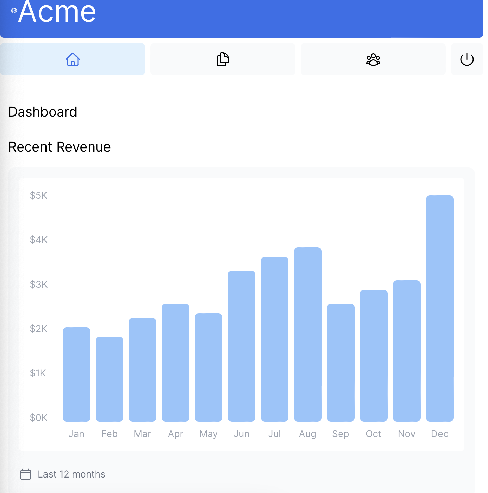

## 8.4 Fetching data for <LatestInvoices/>

1. fetchLatestInvoices 호출
2. dashboard/page.tsx에서 fetchLatestInvoices 와 관련된 컴포넌트 주석 해제
3. (`/app/ui/dashboard/latest-invoices.tsx`) 내부의 관련 코드도 주석 해제

`/app/ui/dashboard/page.tsx`
```typescript
import { Card } from '@/app/ui/dashboard/cards';
import RevenueChart from '@/app/ui/dashboard/revenue-chart';
import LatestInvoices from '@/app/ui/dashboard/latest-invoices';
import { lusitana } from '@/app/ui/fonts';
import { fetchRevenue, fetchLatestInvoices } from '@/app/lib/data';

export default async function Page() {
  const revenue = await fetchRevenue();
  const latestInvoices = await fetchLatestInvoices();
  // ...
}
```

4. 브라우저 확인

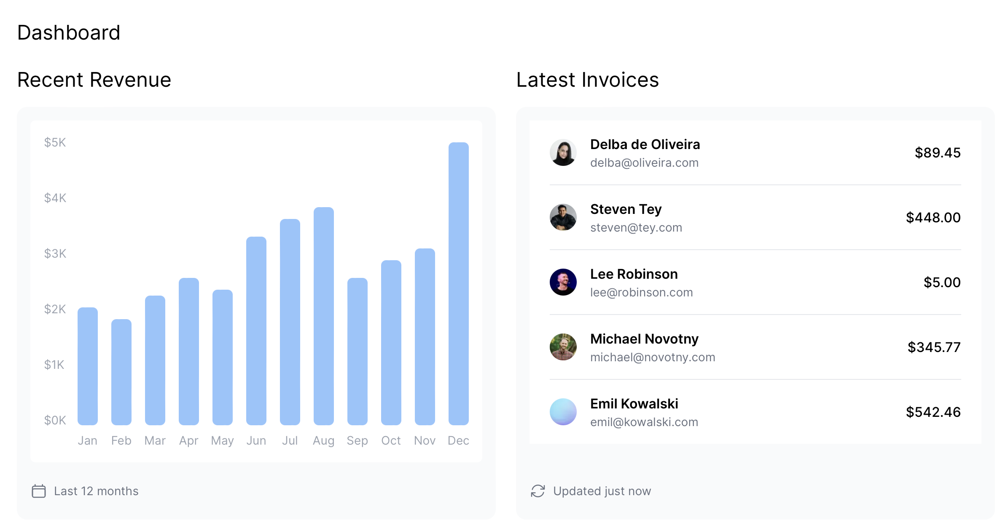

## Fetch data for the <Card> components

브라우저에서 확인하기

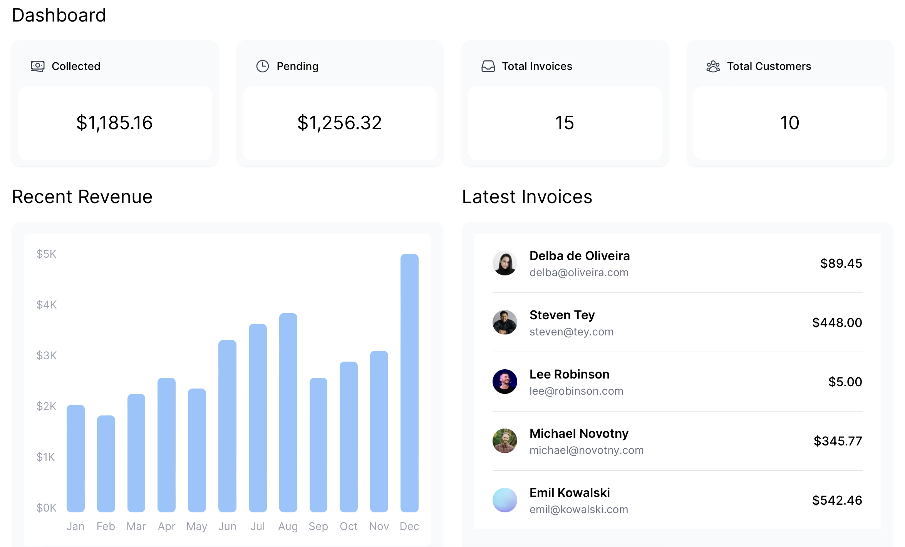

## 데이터 관리법

### Request Waterfalls

waterfall 방식은 이전 요청이 끝날때까지 기다리는 순차적인 방식을 의미합니다.
데이터 페칭의 경우, 각 요청은 이전 요청이 데이터를 반환할 때까지 시작할 수 없습니다.

예시 `/dashboard/page.tsx`

fetchReveneu()가 실행된 후에 latestInvoices()를 시작할 수 있습니다.

```typescript
const revenue = await fetchRevenue();
const latestInvoices = await fetchLatestInvoices(); // fetchRevenue()가 완료될 때까지 대기
const {
  numberOfInvoices,
  numberOfCustomers,
  totalPaidInvoices,
  totalPendingInvoices,
} = await fetchCardData(); // fetchLatestInvoices()가 완료될 때까지 대기
```

### Parallel data fetching

waterfalls 방식 대신 성능을 개선하기 위해 병렬 데이터 페칭을 사용하여 데이터 요청을 동시에 진행해 애플리케이션 로딩 시간을 단축할 수 있습니다.

- **병렬 페칭의 원리**
병렬 데이터 페칭은 Promise.all() 또는 Promise.allSettled() 함수를 사용하여 
모든 프로미스를 동시에 초기화하는 방식입니다.

예시 `/app/lib/data.js`
```typescript
export async function fetchCardData() {
  try {
    const invoiceCountPromise = sql`SELECT COUNT(*) FROM invoices`;
    const customerCountPromise = sql`SELECT COUNT(*) FROM customers`;
    const invoiceStatusPromise = sql`SELECT
         SUM(CASE WHEN status = 'paid' THEN amount ELSE 0 END) AS "paid",
         SUM(CASE WHEN status = 'pending' THEN amount ELSE 0 END) AS "pending"
         FROM invoices`;

    const data = await Promise.all([
      invoiceCountPromise,
      customerCountPromise,
      invoiceStatusPromise,
    ]);
    // ...
  }
}
```

# 정적 및 동적 대시보드 구현하기

## 정적 렌더링 

정적 렌더링은 데이터 페칭과 렌더링이 서버에서 배포시에 이루어집니다. 배포된 결과는 CDN에서 배포및 캐싱될 수 있습니다.

- **정적 렌더링의 장점**
  - 웹사이트 속도 향상 : 사전 렌더링된 콘텐츠를 통해 사용자는 빠르고 안정적으로 웹사이트레 접근할 수 있습니다.
  - 서버 부하 감소 : 콘텐츠가 캐시되기 때문에 서버는 각 사용자 요청에 동적으로 콘텐츠를 생성할 필요가 없습니다.
  - SEO 최적화 : 사전 렌더링된 콘텐츠는 검색 엔진 크롤러가 색인을 생성하기 쉽워 검색 엔진을 향상시킬 수 있습니다.

## 동적 렌더링

동적 렌더링은 콘텐츠가 사용자가 페이지를 방문할 때마다 서버에서 렌더링 됩니다.

- **동적 렌더링의 장점**
  - 실시간 데이터: 동적 렌더링을 통해 애플리케이션은 실시간 또는 자주 업데이트되는 데이터를 표시할 수 있습니다.
  - 사용자별 콘텐츠: 개인화된 콘텐츠, 예를 들어 대시보드나 사용자 프로필을 쉽게 제공하고 사용자 상호작용에 따라 데이터를 업데이트할 수 있습니다.
  - 요청 시점 정보: 요청 시점에만 알 수 있는 정보(예: 쿠키 또는 URL 검색 파라미터)에 접근할 수 있습니다.

## 대시보드 동적으로 만들기

next js는 `unstable_noStore` 라는 API를 제공하여 동적데이터를 필요로 하는 컴포넌트나 데이터 패칭 함수에서
데이터가 캐싱되지 않도록 설정할 수 있습니다.


/app/lib/data.ts 에서 fetching 함수를 아래와 같이 수정할 수 있습니다.

```typescript
// ...
import { unstable_noStore as noStore } from 'next/cache';
 
export async function fetchRevenue() {
  // Add noStore() here to prevent the response from being cached.
  // This is equivalent to in fetch(..., {cache: 'no-store'}).
  noStore();
 
  // ...
}
 
export async function fetchLatestInvoices() {
  noStore();
  // ...
}
 
export async function fetchCardData() {
  noStore();
  // ...
}
 
export async function fetchFilteredInvoices(
  query: string,
  currentPage: number,
) {
  noStore();
  // ...
}
 
export async function fetchInvoicesPages(query: string) {
  noStore();
  // ...
}
 
export async function fetchFilteredCustomers(query: string) {
  noStore();
  // ...
}
 
export async function fetchInvoiceById(query: string) {
  noStore();
  // ...
}
```

## 지연되는 데이터 페칭 대응하기

### 스트리밍

스트리밍은 데이터를 서버에서 클라이언트로 준비되는 대로 전송하는 데이터 전송 기술입니다.

스트리밍을 통해, 느린 데이터 요청이 전체 페이지를 보여주지 못하는 문제를 방지할 수 있습니다.

모든 데이터가 로드되기 전에 페이지의 일부를 사용자에게 노출할 수 있게 해줍니다.

스트리밍은 컴포넌트 모델과 잘 어울립니다. 각 컴포넌트를 하나의 조각으로 간주하여 조각이 준비되는대로 전송할 수 있기 때문입니다.

스트리밍을 구현하는 방법은 두가지가 있습니다.

1. 페이지 수준에서 `loading.tsx`를 이용합니다.
   - loading.tsx는 페이지가 로드되는 동안 사용자에게 표시되는 임시 UI 입니다. 이 방법을 통해 데이터를 패칭하는 동안 로딩 화면을 표시할 수 있습니다.

2. 특정 컴포넌트에 `<Suspense>` 를 사용합니다.
   - 컴포넌트들의 로딩 상태를 처리합니다. 특정 컴포넌트가 데이터를 로드하는 동안 대체 컨텐츠를 표시할 수 있습니다.

### 실제 구현

* **loading.tsx**

`/app/dashboard` 내에 `loading.tsx` 파일을 생성합니다.

해당 파일은 Next.js의 특수한 파일로 페이지 콘텐츠가 로드되는 동안 표시할 대체 UI를 생성할 수 있게 해줍니다.

```typescript
export default function Loading() {
  return <div>Loading...</div>;
}
```

* **로딩 스켈레톤**

데이터가 로드되는 동안 콘텐츠의 레이아웃을 대략적으로 표시하는 UI 패턴입니다.

앞서 만든 `loading.tsx` 파일에서 `<DashboardSkeleton>` 컴포넌트를 추가해줍니다.

```typescript
import DashboardSkeleton from '@/app/ui/skeletons';
 
export default function Loading() {
  return <DashboardSkeleton />;
}
```

로딩중인 모습

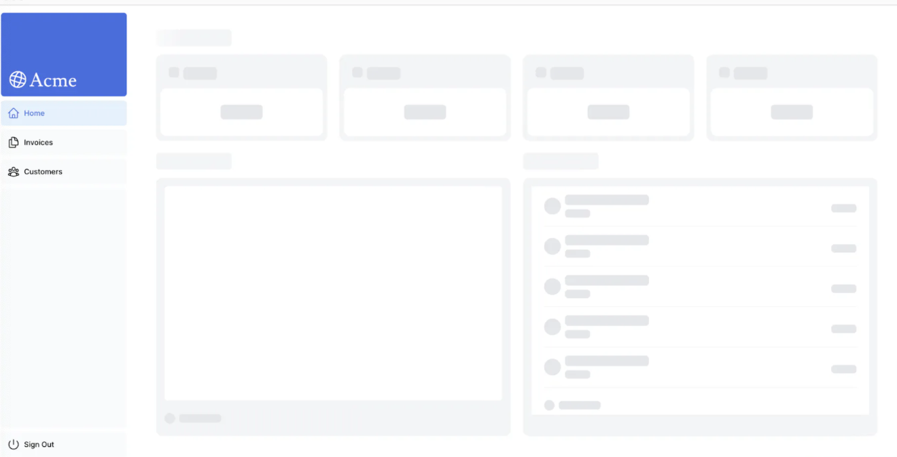

데이터 페칭이 완료된 모습

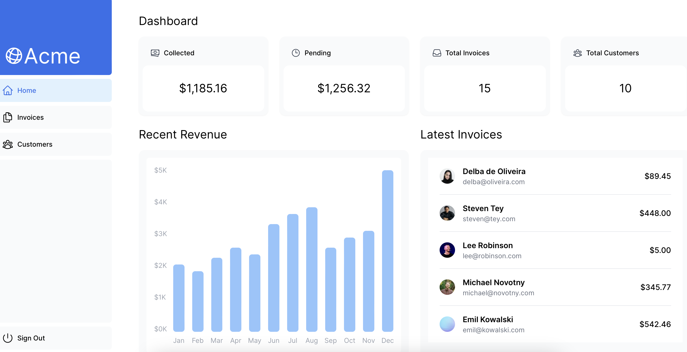

### route group

* **스켈레톤 컴포넌트 버그 수정하기**

현재 구성된 로딩 스켈레톤은 `dashboard` 뿐만 아니라 `invoices` 와 `customers` 페이지에도 일괄 적용되고 있습니다.

`loading.tsx` 가 파일시스템에서 `/invoices/page.tsx`와 `/customers/page.tsx`보다 상위 레벨에 위치하고 있기 때문입니다.

route group을 통해 특정 페이지에만 적용되게 변경할 수 있습니다.

`/dashboard/(overview)` 라는 새 폴더를 생성합니다. 이후 `loading.tsx` 파일과 `page.tsx` 파일을 넣어줍니다.
이렇게 하면 대시보드의 개요 페이지에만 적용이 되게 됩니다.

* **route group의 이점**

URL 경로 구조에 영향을 주지 않고 파일을 조직할 수 있습니다. () 를 사용해 새 폴더를 생성하면 그 이름은 URL 경로에 포함되지 않습니다.

라우트 그룹을 통해 애플리케이션을 관리하기 쉬운 구조로 조직화 할 수 있습니다.

### Suspense 를 사용해 특정 컴포넌트 스트리밍 하기

`Suspense` 를 사용하면 특정 조건이 충족될 때 까지 애플리케이션의 일부를 지연시킬 수 있습니다.
이를 통해 동적 컴포넌트를 `Suspense`로 감싼 다음, 동적 컴포넌트가 로드되는 동안 표시할 대체 컴포넌트를 전달 할 수 있습니다.

현재 `fetchRevenue()` 함수는 전체 페이지 로딩을 지연시키고 있습니다. `Suspense`를 사용하여 이 컴포넌트만 스트리밍 하고 페이지의 나머지 UI를 우선 표시할 수 있습니다.

`/dashboard/(overview)/page.tsx` 에서 `fetchRevenue()` 함수와 그 데이터의 모든 인스턴스를 삭제합니다.

그리고 `<Suspense>` 컴포넌트로 `<RevenueChard />` 를 감싸줍니다.
로딩되는 동안 표시될 `<RevenueChartSkeleton>` 컴포넌트도 넣어줍니다.


```typescript
import { Card } from '@/app/ui/dashboard/cards';
import RevenueChart from '@/app/ui/dashboard/revenue-chart';
import LatestInvoices from '@/app/ui/dashboard/latest-invoices';
import { inter } from '@/app/ui/fonts';
import { fetchLatestInvoices, fetchCardData } from '@/app/lib/data';
import {Suspense} from "react";
import {RevenueChartSkeleton} from "@/app/ui/skeletons";


export default async function Page() {
  const latestInvoices = await fetchLatestInvoices();
  const {
    numberOfInvoices,
    numberOfCustomers,
    totalPaidInvoices,
    totalPendingInvoices,
  } = await fetchCardData();
}
```

`<RevenuChard>` 컴포넌트 내부에서 자체 데이터를 패치하도록 업데이트 합니다.

`/app/ui/dashboard/revenue-chart.tsx`

```typescript
import { generateYAxis } from '@/app/lib/utils';
import { CalendarIcon } from '@heroicons/react/24/outline';
import { lusitana } from '@/app/ui/fonts';
import { fetchRevenue } from '@/app/lib/data';
 
// ...
 
export default async function RevenueChart() { // Make component async, remove the props
  const revenue = await fetchRevenue(); // Fetch data inside the component
 
  const chartHeight = 350;
  const { yAxisLabels, topLabel } = generateYAxis(revenue);
 
  if (!revenue || revenue.length === 0) {
    return <p className="mt-4 text-gray-400">No data available.</p>;
  }
 
  return (
      <main>
        <h1 className={`${inter.className} mb-4 text-xl md:text-2xl`}>
          Dashboard
        </h1>
        <div className="grid gap-6 sm:grid-cols-2 lg:grid-cols-4">
          { <Card title="Collected" value={totalPaidInvoices} type="collected" /> }
          { <Card title="Pending" value={totalPendingInvoices} type="pending" /> }
          { <Card title="Total Invoices" value={numberOfInvoices} type="invoices" /> }
          { <Card
                  title="Total Customers"
                  value={numberOfCustomers}
                  type="customers"
          /> }
        </div>
        <div className="mt-6 grid grid-cols-1 gap-6 md:grid-cols-4 lg:grid-cols-8">
          <Suspense fallback={<RevenueChartSkeleton />}>
            <RevenueChart />
          </Suspense>
          <LatestInvoices latestInvoices={latestInvoices} />
        </div>
      </main>
  );
}
```

브라우저에서 확인

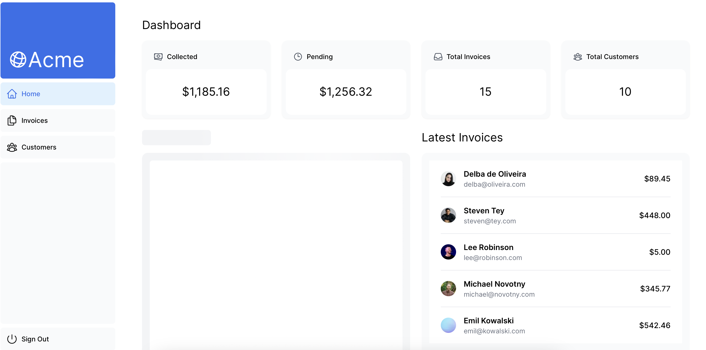

### 컴포넌트 그룹화

`<Card>` 컴포넌트들을 Suspense로 래핑하는 작업을 진행하겠습니다.

정적인 컴포넌트가 우선 표시된 후, 그 다음 동적인 카드를 표시하게 할 수 있습니다.

`/dashboard/(overview)/page.tsx`

```typescript
import RevenueChart from '@/app/ui/dashboard/revenue-chart';
import LatestInvoices from '@/app/ui/dashboard/latest-invoices';
import { inter } from '@/app/ui/fonts';
import {Suspense} from "react";
import CardWrapper from '@/app/ui/dashboard/cards';
import {RevenueChartSkeleton, LatestInvoicesSkeleton, CardsSkeleton } from "@/app/ui/skeletons";


export default async function Page() {
    return (
        <main>
            <h1 className={`${inter.className} mb-4 text-xl md:text-2xl`}>
                Dashboard
            </h1>
            <div className="grid gap-6 sm:grid-cols-2 lg:grid-cols-4">
                <Suspense fallback={<CardsSkeleton />}>
                    <CardWrapper />
                </Suspense>
            </div>

```

`/app/ui/dashboard/cards.tsx`

```typescript
// ...
import { fetchCardData } from '@/app/lib/data';
 
// ...
 
export default async function CardWrapper() {
  const {
    numberOfInvoices,
    numberOfCustomers,
    totalPaidInvoices,
    totalPendingInvoices,
  } = await fetchCardData();
 
  return (
    <>
      <Card title="Collected" value={totalPaidInvoices} type="collected" />
      <Card title="Pending" value={totalPendingInvoices} type="pending" />
      <Card title="Total Invoices" value={numberOfInvoices} type="invoices" />
      <Card
        title="Total Customers"
        value={numberOfCustomers}
        type="customers"
      />
    </>
  );
}
```

이 방식을 적용하고 페이지를 새로고침하면, 모든 카드가 동시에 로드되는 것을 확인 할 수 있습니다.

routing group을 통해 여러 컴포넌트를 동시에 로드할 수 있습니다.

### `<Suspense>` 사용 전략

**배치 시 고려할 사항**

* 페이지가 스트리밍됨에 따라 사용자가 경험할 페이지의 흐름. 
* 우선 순위를 둘 콘텐츠의 종류. 
* 컴포넌트가 데이터 패칭에 의존하는지 여부.

방법 1. loading.tsx - 전체 페이지를 스트리밍 할 수 있지만, 컴포넌트 중 하나 때문에 로딩 시간이 지연될 수 있다.

방법 2. 모든 컴포넌트를 개별적으로 스트리밍 할 수 있지만 준비되는 대로 UI가 표시되어 시각적으로 불편할 수 있다.

방법 3. 래퍼 컴포넌트를 통해 그룹별 스트리밍 할 수 있다.

# Search and Pagination

`/invoices page`에서 `serch` 와 `pagination` 기능을 추가해볼 수 있습니다.

`/app/dashboard/invoices/page.tsx`
```typescript
import Pagination from '@/app/ui/invoices/pagination';
import Search from '@/app/ui/search';
import Table from '@/app/ui/invoices/table';
import { CreateInvoice } from '@/app/ui/invoices/buttons';
import { lusitana } from '@/app/ui/fonts';
import { InvoicesTableSkeleton } from '@/app/ui/skeletons';
import { Suspense } from 'react';
 
export default async function Page() {
  return (
    <div className="w-full">
      <div className="flex w-full items-center justify-between">
        <h1 className={`${lusitana.className} text-2xl`}>Invoices</h1>
      </div>
      <div className="mt-4 flex items-center justify-between gap-2 md:mt-8">
        <Search placeholder="Search invoices..." />
        <CreateInvoice />
      </div>
      {/*  <Suspense key={query + currentPage} fallback={<InvoicesTableSkeleton />}>
        <Table query={query} currentPage={currentPage} />
      </Suspense> */}
      <div className="mt-5 flex w-full justify-center">
        {/* <Pagination totalPages={totalPages} /> */}
      </div>
    </div>
  );
}
```

**컴포넌트 설명**

- `<Search/>`는 사용자가 특정 인보이스를 검색할 수 있게 합니다.
- `<Pagination/>`는 사용자가 인보이스 페이지를 넘나들 수 있게 합니다.
- `<Table/>`은 인보이스를 표시합니다.

검색 기능은 클라이언트와 서버 양쪽에서 작동합니다.
사용자가 클라이언트에서 인보이스를 검색할 때 URL 파라미터가 업데이트되고, 
데이터는 서버에서 패치되며, 새로운 데이터로 테이블이 서버에서 다시 렌더링됩니다.

## URL 검색 파라미터

Next.js에서는 클라이언트 측 상태에 검색 상태를 관리하는게 아닌 URL 검색 파라미터를 사용합니다.

**검색 파라미터의 장점**

**북마크 가능하고 공유 가능한 URL** - 검색 파라미터가 URL에 포함되어 있기 때문에, 사용자는 현재 상태 및 검색 쿼리와 필터등을 저장할 수 있습니다.

**서버 사이드 렌더링 및 초기로드** - URL 파라미터는 서버에서 직접 사용할 수 있어 초기 상태를 렌더링하는데 유리합니다.

**분석 및 추적** - 검색 쿼리와 필터가 URL에 포함되어 있기 때문에, 클라이언트 로직 없이 사용자의 행동을 추적할 수 있습니다.

## 검색 기능 추가하기

Next.js 의 클라이언트 훅을 사용하여 검색 기능을 구현할 수 있습니다.

**사용할 Next.js 클라이언트 훅**

- **useSearchParams** - 현재 URL의 파라미터에 접근할 수 있게 해줍니다. 예를 들어, `/dashboard/invoices?page=1&query=pending` URL에 대한 검색 파라미터는 `{page: '1', query: 'pending'}` 입니다.
- **usePathname** - 현재 URL의 경로명(pathname)을 읽을 수 있게 해줍니다. 예를 들어, `/dashboard/invoices` 라우트에 대해 usePathname은 `/dashboard/invoices`를 반환합니다. 
- **useRouter** - 클라이언트 컴포넌트 내에서 라우트 간의 이동을 가능하게 합니다.

**구현 프로세스**

1. 사용자 입력 확인
2. URL을 검색 파라미터로 업데이트
3. 입력 필드와 URL 동기화 유지
4. 검색 쿼리를 반영하여 테이블 업데이트

### 사용자 입력 확인

`/app/ui/search.tsx`

```typescript
'use client';
 
import { MagnifyingGlassIcon } from '@heroicons/react/24/outline';
 
export default function Search({ placeholder }: { placeholder: string }) {
  function handleSearch(term: string) {
    console.log(term);
  }
 
  return (
    <div className="relative flex flex-1 flex-shrink-0">
      <label htmlFor="search" className="sr-only">
        Search
      </label>
      <input
        className="peer block w-full rounded-md border border-gray-200 py-[9px] pl-10 text-sm outline-2 placeholder:text-gray-500"
        placeholder={placeholder}
        onChange={(e) => {
          handleSearch(e.target.value);
        }}
      />
      <MagnifyingGlassIcon className="absolute left-3 top-1/2 h-[18px] w-[18px] -translate-y-1/2 text-gray-500 peer-focus:text-gray-900" />
    </div>
  );
}
```

`"use client"` - 클라이언트에서 사용될 컴포넌트를 의미합니다. 이벤트 리스너와 훅을 사용할 수 있습니다.
`<input>` - 검색 입력 필드입니다.
`handleSearch` - 유저의 입력값을 포착할 함수를 선언합니다.
`<input>` 요소에 `onChange` 리스너를 추가하여 입력 값이 변경될 때마다 `handleSearch` 함수를 호출하도록 합니다.


**invoce 채널에 입력 요소가 생긴 모습**
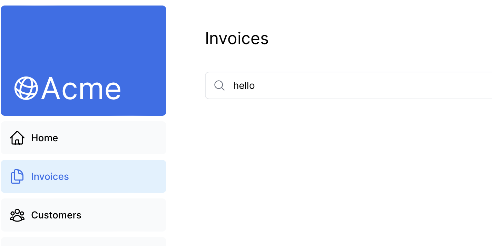

**콘솔 로그 확인하기**
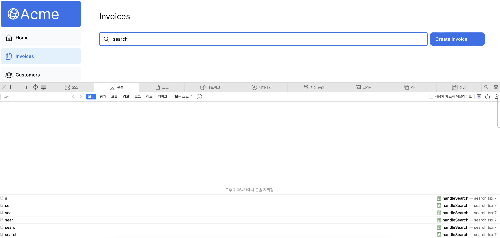

검색 필드에 입력하는 동안, <Search> 컴포넌트의 onChange 이벤트 핸들러에 의해 설정된 handleSearch 함수가 호출되며,
이 함수 내에서 console.log()를 통해 검색어가 로그로 출력됩니다.

#### 10.2.2 URL을 검색 파라미터로 업데이트

앞서 구현한 사용자 입력 포착 기능으로, 이제 사용자가 입력한 검색어를 URL에 반영하여 애플리케이션의 상태를 동적으로 관리할 수 있습니다.

`'next/navigation'`에서 `useSearchParams` 훅을 임포트하고, `defaultValue`에 할당합니다.

`/app/ui/search.tsx`

```typescript
'use client';

import { MagnifyingGlassIcon } from '@heroicons/react/24/outline';
import { useSearchParams } from 'next/navigation';

export default function Search() {
  const searchParams = useSearchParams();

  function handleSearch(term: string) {
    console.log(term);
  }
  // ...
}
```

`handleSearch` 함수 내부에서 앞서 생성한 searchParmas를 인자로 받는 새로운 `URLSearchParams` 인스턴스를 생성합니다. 

```typescript
'use client';
 
import { MagnifyingGlassIcon } from '@heroicons/react/24/outline';
import { useSearchParams } from 'next/navigation';
 
export default function Search() {
  const searchParams = useSearchParams();
 
  function handleSearch(term: string) {
    const params = new URLSearchParams(searchParams);
  }
  // ...
}
```

`URLSearchParams`는 웹 API의 일부로, URL의 쿼리 파라미터를 조작하는데 사용되는 메소드를 제공합니다.

이를 통해 개발자가 URL 쿼리 스트링을 쉽게 조작할 수 있습니다. 예를 들어 `?page=1&query=a`
와 같은 쿼리를 만들 수 있습니다.

아래 코드는 사용자의 입력이 있다면 query 파라미터를 설정하고 없으면 삭제합니다.

```typescript
'use client';
 
import { MagnifyingGlassIcon } from '@heroicons/react/24/outline';
import { useSearchParams } from 'next/navigation';
 
export default function Search() {
  const searchParams = useSearchParams();
 
  function handleSearch(term: string) {
    const params = new URLSearchParams(searchParams);
    if (term) {
      params.set('query', term);
    } else {
      params.delete('query');
    }
  }
  // ...
}
```

`useRouter`와 `usePathname`을 임포트하고, `useRouter()`의 `replace` 메서드를 사용하여 URL을 업데이트합니다.

`/app/ui/search.tsx`

```typescript
'use client';
 
import { MagnifyingGlassIcon } from '@heroicons/react/24/outline';
import { useSearchParams, usePathname, useRouter } from 'next/navigation';
 
export default function Search() {
  const searchParams = useSearchParams();
  const pathname = usePathname();
  const { replace } = useRouter();
 
  function handleSearch(term: string) {
    const params = new URLSearchParams(searchParams);
    if (term) {
      params.set('query', term);
    } else {
      params.delete('query');
    }
    replace(`${pathname}?${params.toString()}`);
  }
}
```

이렇게 하면 사용자가 검색 바에 입력할 때마다 `${pathname}?${params.toString()}`가 URL을 동적으로 업데이트합니다.

예를 들어 사용자가 "Lee"를 검색하면 `/dashboard/invoices?query=lee`와 같이 URL이 업데이트됩니다. 이 구현을 통해, 검색 기능이 URL에 반영되게 됩니다.

또한, Next.js의 클라이언트 측 네비게이션을 활용하여 페이지를 새로고침하지 않고도 URL을 업데이트할 수 있습니다.

### URL과 입력 필드 동기화 하기

사용자가 애플리케이션 내에서 검색을 수행할 때, 그 검색 상태를 URL에 반영하여 해당 상태를 공유할 수 있도록 합니다. 이는 공유 받은 사람들도 검색 쿼리가 URL에 반영되기 때문에 같은 검색 결과를 볼 수 있게 됩니다.

이를 통해 사용자의 검색 상태가 URL에 저장이 되며, 애플리케이션은 사용자가 접근한 URL을 확인하고 이전 검색상태를 복원할 수 있게 됩니다.

**구현방법**

`useSearchParams` 훅을 사용하여 URL의 파라미터에 접근하고, 입력 필드에 `defaultValue` 속성을 통해 두 값을 동기화 할 수 있습니다.

`/app/ui/search.tsx`

```typescript
<input
  className="peer block w-full rounded-md border border-gray-200 py-[9px] pl-10 text-sm outline-2 placeholder:text-gray-500"
  placeholder={placeholder}
  onChange={(e) => {
    handleSearch(e.target.value);
  }}
  defaultValue={searchParams.get('query')?.toString()}
/>
```

**제어 컴포넌트 vs 비 제어 컴포넌트**

* 제어 컴포넌트 (Controlled Component) - 제어 컴포넌트는 `value` 속성을 통해 React가 입력 필드의 상태를 직접 관리하는 방식입니다. 
이 방식에서는 입력 필드에 직접 입력하는 것이 아니라, 상태(state) 변경을 통해 입력값이 조절됩니다. 
이는 React 상태를 통해 입력 필드의 값이 언제나 동기화되어 있음을 보장하며, 상태 관리 로직을 React 내부에 집중시킬 수 있습니다.

* 비제어 컴포넌트 (Uncontrolled Component) - 비제어 컴포넌트는 `defaultValue` 속성을 사용하여 입력 필드가 자체 상태를 관리하도록 합니다. 

**URL 쿼리 파라미터와 `defaultValue`**

```typescript
defaultValue={searchParams.get('query')?.toString()}
```
이 코드는 URL의 쿼리 파라미터가 있다면 그 값으로 입력 필드의 초기값을 설정하는 코드입니다.

이 접근 방식의 장점은 사용자가 특정 검색어로 페이지에 접근했을 때 (예: /search?query=example), 해당 검색어(example)가 입력 필드에 자동으로 채워져서 표시되도록 할 수 있다는 점입니다.

### 테이블 컴포넌트 업데이트 하기

사용자의 컴색 쿼리에 따라 테이블 컴포넌트를 업데이트 할 수 있습니다.

`/dashboard/invoices/page.tsx`

```typescript
import Pagination from '@/app/ui/invoices/pagination';
import Search from '@/app/ui/search';
import Table from '@/app/ui/invoices/table';
import { CreateInvoice } from '@/app/ui/invoices/buttons';
import { lusitana } from '@/app/ui/fonts';
import { Suspense } from 'react';
import { InvoicesTableSkeleton } from '@/app/ui/skeletons';
 
export default async function Page({
  searchParams,
}: {
  searchParams?: {
    query?: string;
    page?: string;
  };
}) {
  const query = searchParams?.query || '';
  const currentPage = Number(searchParams?.page) || 1;
 
  return (
    <div className="w-full">
      <div className="flex w-full items-center justify-between">
        <h1 className={`${lusitana.className} text-2xl`}>Invoices</h1>
      </div>
      <div className="mt-4 flex items-center justify-between gap-2 md:mt-8">
        <Search placeholder="Search invoices..." />
        <CreateInvoice />
      </div>
      <Suspense key={query + currentPage} fallback={<InvoicesTableSkeleton />}>
        <Table query={query} currentPage={currentPage} />
      </Suspense>
      <div className="mt-5 flex w-full justify-center">
        {/* <Pagination totalPages={totalPages} /> */}
      </div>
    </div>
  );
}
```

`<Table>` 컴포넌트 내에서 `(app/ui/invoices/table.tsx)` `query` 및 `currentPage` `prop`을 사용하여 검색조건에 맞는 `invoice`를 fetching 하는 로직을 확인할 수 있습니다.

```typescript
// 필요한 import들...

export default async function InvoicesTable({
  query,
  currentPage,
}: {
  query: string;
  currentPage: number;
}) {
  // 검색 쿼리와 현재 페이지를 기반으로 필터링된 인보이스 패칭
  const invoices = await fetchFilteredInvoices(query, currentPage);
  // 인보이스 데이터를 테이블에 반영하는 로직...
}
```

**useSearchParams() 훅 vs. searchParams prop**

클라이언트 컴포넌트인 `<Search>`에서는 `useSearchParams()` 훅을 사용하여 클라이언트 측에서 파라미터에 접근했습니다. 

반면에, 서버에서 데이터를 패칭하는 `<Table>` 컴포넌트는 페이지 컴포넌트로부터 `searchParams` prop을 전달받아 사용했습니다. 

클라이언트에서 파라미터를 읽어야 할 때는 `useSearchParams()` 훅을 사용하고, 서버에서 처리할 때는 prop을 통해 필요한 파라미터를 컴포넌트로 전달하는 것이 좋습니다.

## debouncing

디바운싱은 함수가 실행될 수 있는 비율을 제한하는 관행입니다. 이를 통해 사용자가 타이핑을 멈췄을 때만 데이터베이스를 쿼리할 수 있도록 설정할 수 있습니다.

디바운싱이 적용되지 않는다면 사용자가 입력할 때마다 아래와 같이 데이터베이스를 쿼리하게 될 것입니다.

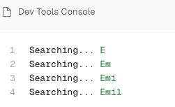

**디바운싱 작동 방식**

* 트리거 이벤트: 디바운싱되어야 할 이벤트(예: 검색 상자에서의 키 입력)가 발생하면 타이머가 시작됩니다.
* 대기: 타이머가 만료되기 전에 새 이벤트가 발생하면 타이머가 리셋됩니다.
* 실행: 타이머가 카운트다운의 끝에 도달하면 디바운스된 함수가 실행됩니다.

`use-debounce` 라이브러리 활용

`/app/ui/search.tsx`

```typescript
// ...
import { useDebouncedCallback } from 'use-debounce';
 
// Inside the Search Component...
const handleSearch = useDebouncedCallback((term) => {
  console.log(`Searching... ${term}`);
 
  const params = new URLSearchParams(searchParams);
  if (term) {
    params.set('query', term);
  } else {
    params.delete('query');
  }
  replace(`${pathname}?${params.toString()}`);
}, 300);
```

사용자가 타이핑을 멈춘 후 300ms 가 지난 후에 코드가 실행될 수 있도록 합니다.

## Pagination

사용자가 페이지를 넘겨가며 모든 결과 쿼리를 확인할 수 있습니다.

`/dashboard/invoices/page.tsx` 서버에서 데이터를 fetching 합니다.

```typescript
// ...
import { fetchInvoicesPages } from '@/app/lib/data';
 
export default async function Page({
  searchParams,
}: {
  searchParams?: {
    query?: string,
    page?: string,
  },
}) {
  const query = searchParams?.query || '';
  const currentPage = Number(searchParams?.page) || 1;
 
  const totalPages = await fetchInvoicesPages(query);
 
  return (
    // ...
  );
}
```

`<pagination/>` 컴포넌트에 totalPages prop을 전달합니다.

```typescript
// ...
 
export default async function Page({
  searchParams,
}: {
  searchParams?: {
    query?: string;
    page?: string;
  };
}) {
  const query = searchParams?.query || '';
  const currentPage = Number(searchParams?.page) || 1;
 
  const totalPages = await fetchInvoicesPages(query);
 
  return (
    <div className="w-full">
      <div className="flex w-full items-center justify-between">
        <h1 className={`${lusitana.className} text-2xl`}>Invoices</h1>
      </div>
      <div className="mt-4 flex items-center justify-between gap-2 md:mt-8">
        <Search placeholder="Search invoices..." />
        <CreateInvoice />
      </div>
      <Suspense key={query + currentPage} fallback={<InvoicesTableSkeleton />}>
        <Table query={query} currentPage={currentPage} />
      </Suspense>
      <div className="mt-5 flex w-full justify-center">
        <Pagination totalPages={totalPages} />
      </div>
    </div>
  );
}
```

**pagination component 구현**

`<Pagination/>` 컴포넌트는 클라이언트 컴포넌트로, 현재 페이지와 총 페이지 수를 기반으로 페이지네이션을 구현합니다.

새 페이지 번호를 설정하기 위해 `URLSearchParams`를 사용하고, `pathname`을 사용하여 URL 문자열을 생성합니다.

```typescript
'use client';
 
import { ArrowLeftIcon, ArrowRightIcon } from '@heroicons/react/24/outline';
import clsx from 'clsx';
import Link from 'next/link';
import { generatePagination } from '@/app/lib/utils';
import { usePathname, useSearchParams } from 'next/navigation';
 
export default function Pagination({ totalPages }: { totalPages: number }) {
  const pathname = usePathname();
  const searchParams = useSearchParams();
  const currentPage = Number(searchParams.get('page')) || 1;
 
  // ...
}
```

**페이지 번호 리셋**

`<Search>` 컴포넌트의 handleSearch 함수를 업데이트 합니다.

```typescript
'use client';
import { useDebouncedCallback } from 'use-debounce';
import { usePathname, useRouter, useSearchParams } from 'next/navigation';
// 기타 필요한 import들...

export default function Search({ placeholder }: { placeholder: string }) {
  const searchParams = useSearchParams();
  const { replace } = useRouter();
  const pathname = usePathname();
 
  const handleSearch = useDebouncedCallback((term) => {
    const params = new URLSearchParams(searchParams);
    params.set('page', '1');  // 페이지 번호를 1로 설정
    if (term) {
      params.set('query', term);
    } else {
      params.delete('query');
    }
    replace(`${pathname}?${params.toString()}`);
  }, 300);
  // 검색 로직...
}
```
