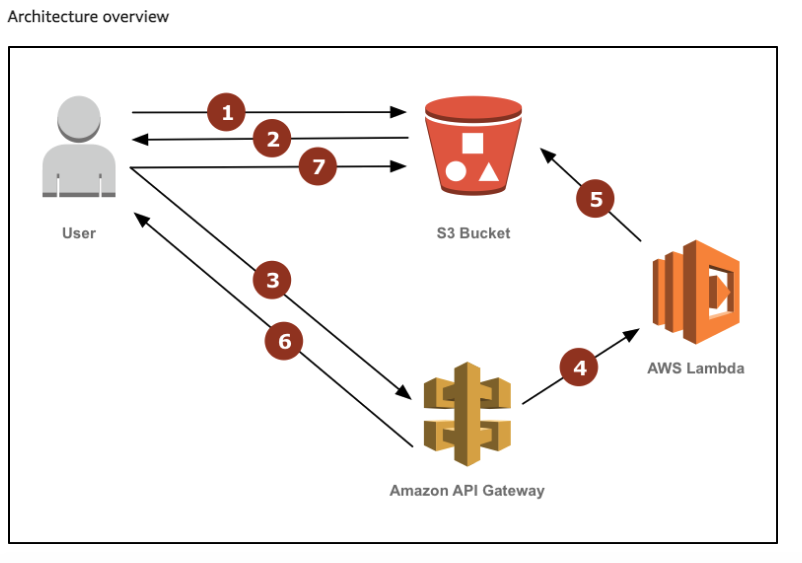
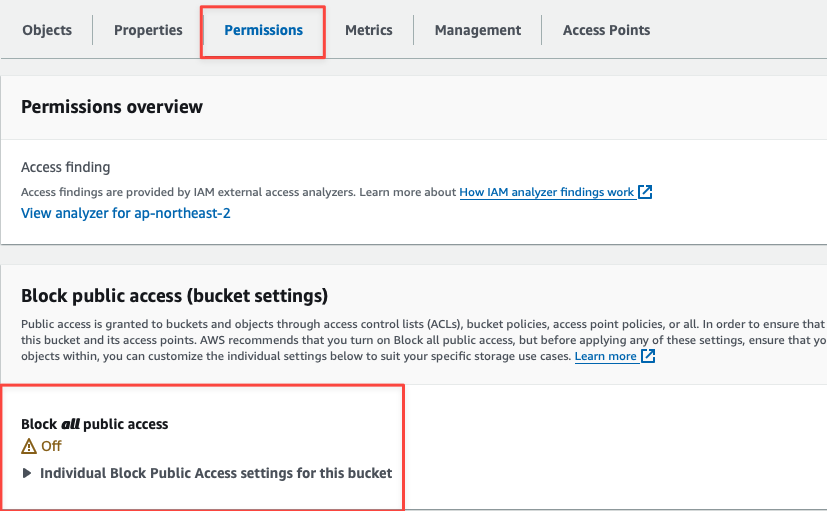
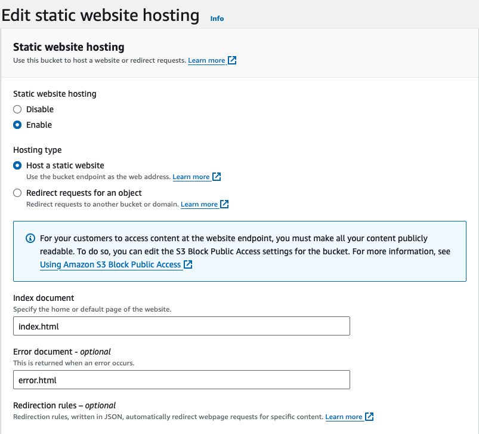

# AWS S3, Lambda, API Gateway를 활용한 실시간 이미지 리사이징 솔루션
{: .no_toc }

## 목차
{: .no_toc .text-delta }

1. TOC
{:toc}

---

## 글을 쓴 배경

다양한 크기의 기기들에게 그에 맞는 이미지를 제공해야 하는 필요성이 생겼습니다. 이 글에서는 특정 크기의 이미지를 요청하면 그에 맞는 이미지를 리사이징 하여 노출하는 방식을 소개합니다.

관련 문서 : [Resize Images on the Fly with Amazon S3, AWS Lambda, and Amazon API Gateway](https://aws.amazon.com/ko/blogs/compute/resize-images-on-the-fly-with-amazon-s3-aws-lambda-and-amazon-api-gateway/)

## 글 요약



1. 사용자가 S3 버킷의 정적 웹사이트 호스팅 엔드포인트를 통해 리사이징된 이미지를 요청합니다.
2. 요청된 이미지가 버킷에 없으면 API Gateway URI 로 리디렉션됩니다.
3. API Gateway가 Lambda 함수를 트리거하여 리사이징 요청을 처리합니다.
4. Lambda 함수가 원본 이미지를 S3 버킷에서 다운로드하고, 리사이징한 후 다시 특정 경로에 업로드합니다.
5. Lambda 함수가 리사이징 처리를 완료하면, API Gateway가 사용자에게 원래 요청한 사이즈의 이미지를 리디렉션합니다.
6. 이후 동일한 사이즈의 요청은 API Gateway 를 거치지 않고, S3 버킷에서 직접 제공됩니다.

## 시작하기 전

- AWS S3 정적 웹사이트 호스팅 법 이해
- API Gateway 람다 통합 설정 이해
- nodejs 20 구현

---

## 1. S3 버킷 생성 및 설정

우선, S3 버킷을 생성하고 공용 액세스 및 정적 웹사이트 호스팅을 설정해야 합니다. 정적 웹사이트 호스팅을 사용하려면 S3 버킷에 저장된 리소스에 대한 공용 접근을 허용해야 합니다.

### 1.1 공용 접근 설정
  * 생성된 버킷을 선택하고 `Permissions` 탭으로 이동 후 `Block all public access` 옵션을 해지하여 공용 접근을 허용합니다.
  * `Block Public Access` 를 해제하면 공용 접근을 허용할 수 있는 상태가 되며 아래 정책 추가를 통해 명시적으로 접근 권한을 부여할 수 있게 됩니다.



### 1.2 버킷 정책 추가
  * Bucket Policy 를 추가하여 버킷 내 객체들에 대한 접근을 허용합니다.

```json
{
    "Version": "2012-10-17",
    "Statement": [
        {
            "Effect": "Allow",
            "Principal": "*",
            "Action": "s3:GetObject",
            "Resource": "arn:aws:s3:::duck's bucket/*"
        }
    ]
}
```

### 1.3 정적 웹사이트 호스팅 설정
  * `Properties` 탭에서 Static website hosting 을 설정할 수 있습니다.



### 1.4 리디렉션 규칙 설정
  * 정적 웹사이트 호스팅 섹션에서 리디렉션 규칙을 설정합니다. 유저가 요청한 이미지가 없을 경우 API Gateway URL로 리디렉션 하도록 설정합니다.

```json
[
    {
        "Condition": {
            "HttpErrorCodeReturnedEquals": "404"
        },
        "Redirect": {
            "HostName": ".execute-api.ap-northeast-2.amazonaws.com",
            "HttpRedirectCode": "307",
            "Protocol": "https",
            "ReplaceKeyPrefixWith": "default/resize?key="
        }
    }
]
```

### 1.5 리디렉션 규칙 적용
  * 없는 이미지를 요청할 때 API Gateway가 이미지 리사이징을 동적으로 수행하고, 새로 생성된 이미지를 반환할 수 있습니다.

* S3 버킷 호스팅 URL을 통해 이미지를 호출하는 방법 예시

```bash
http://duck's bucket.s3-website.ap-northeast-2.amazonaws.com/300x300/blue_marble.jpg
```

* 만약 이미지가 존재하지 않으면 404 오류가 반환됩니다.

* 리디렉션 규칙을 적용한 경우, 이미지가 존재하지 않을 때 설정된 `Condition에` 따라 `Redirect` 동작이 적용됩니다.

```json
[
    {
        "Condition": {
            "HttpErrorCodeReturnedEquals": "404"
        },
        "Redirect": {
            "HostName": ".execute-api.ap-northeast-2.amazonaws.com",
            "HttpRedirectCode": "307",
            "Protocol": "https",
            "ReplaceKeyPrefixWith": "default/resize?key="
        }
    }
]
```

* 이미지가 존재하지 않을 때 리디렉션된 URL 은 아래와 같습니다.

```bash
https://.execute-api.ap-northeast-2.amazonaws.com/default/resize?key=300x300/blue_marble.jpg
```

### 1.6 리디렉션 후 변화

* **호스트 이름 변경**: 버킷 호스트에서 API Gateway 호스트네임으로 변경됩니다.
* **프로토콜 변경**: HTTP에서 HTTPS로 변경됩니다.
* **경로 수정**: 요청 경로의 접두사 300x300/이 default/resize?key=로 교체되어 API Gateway가 요청을 처리할 수 있도록 합니다.

## 2. Lambda와 API Gateway 생성 및 설정

### 2.1 생성된 Lambda 함수의 Resource-based policy 설정

* Lambda에 필요한 권한을 부여하기 위해 Resource-based policy를 설정해야합니다. 이 정책을 통해 특정 서비스나 계정이 Lambda 함수를 호출할 수 있도록 허용할 수 있습니다.


* Permission 탭에서 아래와 같은 정책을 추가하여 API Gateway가 Lambda를 호출 할 수 있도록 합니다. Lambda 함수에 충분한 권한이 있더라도, API Gateway가 해당 함수를 호출하게 하기 위해서는 이 리소스 기반 정책이 필요합니다.

```json
{
  "Version": "2012-10-17",
  "Id": "default",
  "Statement": [
    {
      "Sid": "6ebe2e84-6201-5452-9cfc-5df84374f243",
      "Effect": "Allow",
      "Principal": {
        "Service": "apigateway.amazonaws.com"
      },
      "Action": "lambda:InvokeFunction",
      "Resource": "arn:aws:lambda:ap-northeast-2::function:lmd-s3-object-lambda-image-transformer",
      "Condition": {
        "ArnLike": {
          "AWS:SourceArn": "arn:aws:execute-api:ap-northeast-2::XXXXXX/*/*/resize"
        }
      }
    }
  ]
}
```

* `Principal`을 통해 `Action` 을 수행할 주체를 설정합니다.

### 2.2 Lambda 함수 코드

* s3 버킷에서 이미지를 가져와서 리사이징한 후, 다시 S3 버킷에 업로드하는 역할을 합니다.

### 2.3 Lambda 함수 코드 상세 설명

* **이미지 요청 처리**
  * 요청된 이미지 키를 파싱하여 리사이징할 해상도와 원본 이미지를 식별합니다.
  * match 함수를 통해 배열로 캡쳐된 내용을 가져온 후 해당 내용을 추 후에 사용할 수 있도록 변수로 분리합니다.

```javascript
const key = event.queryStringParameters?.key;
if (!key) {
    console.log('Missing key query parameter');
    return {
        statusCode: 400,
        headers: { 'Content-Type': 'application/json' },
        body: JSON.stringify({ message: 'Bad Request: Missing key query parameter' }),
    };
}

const match = key.match(/((\d+)x(\d+))\/(.*)/);
if (!match) {
    console.log('Invalid key format');
    return {
        statusCode: 400,
        headers: { 'Content-Type': 'application/json' },
        body: JSON.stringify({ message: 'Bad Request: Invalid key format' }),
    };
}

const requestedResolution = match[1];
const width = parseInt(match[2], 10);
const height = parseInt(match[3], 10);
const originalKey = match[4];
```

* **허용된 해상도 확인**
  * 요청된 해상도가 환경 변수로 정의된 허용된 목록에 있는지 확인합니다.
  * process.env.ALLOWED_RESOLUTIONS

```javascript
if (ALLOWED_RESOLUTIONS.size !== 0 && !ALLOWED_RESOLUTIONS.has(requestedResolution)) {
    console.log('Resolution not allowed');
    return {
        statusCode: 403,
        headers: { 'Content-Type': 'application/json' },
        body: JSON.stringify({ message: 'Forbidden: Resolution not allowed' }),
    };
}
```

* **이미지 리사이징 -1**
  * 원본 이미지를 s3로 부터 가져옵니다.

```javascript
const getObjectCommand = new GetObjectCommand({ Bucket: BUCKET, Key: originalKey });
const data = await s3.send(getObjectCommand);
if (!data || !data.Body) {
    console.log('Original image not found');
    return {
        statusCode: 404,
        headers: { 'Content-Type': 'application/json' },
        body: JSON.stringify({ message: 'Not Found: Original image not found' }),
    };
}
``` 

* **이미지 리사이징 -2**
  * sharp 모듈을 사용하여 이미지를 지정된 해상도로 리사이즈 합니다.

```javascript
const resizeStream = sharp().resize(width, height).toFormat(supportedFormats.includes(format) ? format : defaultFormat);
console.log('resizeStream :', resizeStream);
```

* **이미지 리사이징 -3**
  * `pipe` 메서드는 Node.js의 스트림 API에서 제공하는 메소드로, 한 스트림의 출력을 다른 스트림의 입력으로 연결합니다.
  * `data.Body`를 `resizeStream`으로 전달하고 리사이즈 된 데이터 자체를 `PassThrough` 스트림으로 전달합니다.
  * PassThrough 스트림에서 `data`이벤트가 발생할 때마다 데이터를 수집합니다. `end` 이벤트가 발생할 때까지 반복하고 수집된 데이터 청크는 하나의 버퍼로 결합됩니다.

```javascript
const chunks = [];
const passThrough = new stream.PassThrough();

data.Body.pipe(resizeStream).pipe(passThrough);

passThrough.on('data', (chunk) => {
    chunks.push(chunk);
});

await new Promise((resolve, reject) => {
    passThrough.on('end', resolve);
    passThrough.on('error', reject);
});

const buffer = Buffer.concat(chunks);
```

* **리사이징된 이미지 저장**
  * 리사이징된 이미지를 s3 버킷에 저장합니다.
  * 저장할 때 경로는 앞서 요청 들어온 경로로 저장합니다.

```javascript
const newKey = `${width}x${height}/${originalKey}`;
const putObjectCommand = new PutObjectCommand({
    Body: buffer,
    Bucket: BUCKET,
    ContentType: originalContentType,
    Key: newKey,
});

await s3.send(putObjectCommand);
```

* **리디렉션 응답**
  * 사용자에게 리사이징된 이미지로 리디렉션하는 응답을 반환합니다.
  * 특정 상태코드와 Location 헤더를 사용하여 리디렉션을 처리합니다.

```javascript
return {
    statusCode: 307,
    headers: {
        'Location': `${URL}/${newKey}`,
    },
};
```
