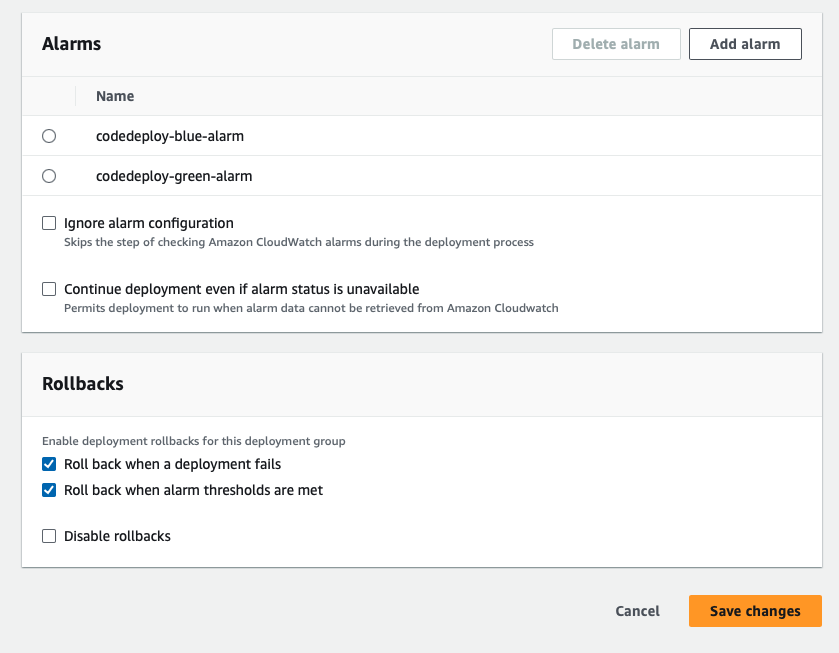

# CodeDeploy ECS Blue/Green 배포시 Install 단계 Timeout 시간 제한 조정 방법 (Feat. CloudWatch Alarm)
{: .no_toc }

## 목차
{: .no_toc .text-delta }

1. TOC
{:toc}

---

## 글을 쓴 배경

AWS ECS로 Blue/Green 배포를 진행하던 중 신규 task set 배포 과정에서 문제가 발생할 경우 Code Deploy의 Install 단계에서 최대 60분 동안 재시도 후 자동으로 실패하고 롤백이 이루어집니다. 

이러한 기본 설정으로 인해 발생하는 시간 지연을 최소화하기 위해, Install 단계의 타임아웃 시간을 조정할 수 있는 방법을 찾게 되었습니다.

관련 문서 : [CodeDeploy ECS Blue/Green 배포 시 Install 단계 Timeout 시간 제한 조정](https://repost.aws/ko/questions/QUlqnLUX5uSH2ZUsMs2aJ_Vw/code-deploy-ecs-blue-green-배포-시-install-단계-timeout-시간-제한-조정)

## 글 요약

AWS ECS에서 Blue/Green 배포를 진행할 때, CodeDeploy의 Install 단계에서 발생할 수 있는 지연을 최소화하기 위해 
Timeout 설정을 조정하는 방법을 설명합니다. 
본문은 CloudWatch Alarm을 사용하여 이러한 문제를 탐지하고 자동으로 대응하는 과정을 다룹니다. 

## 시작하기 전

- AWS ECS와 CodeDeploy의 기본 작동 원리
- Blue/Green 배포 전략에 대한 이해
- AWS CloudWatch의 기본적인 사용법과 메트릭 시스템

---

## 1. AWS CloudWatch 란?

AWS CloudWatch는 AWS 리소스 상태를 모니터링하고 경보를 설정하여 자원의 상태 변화를 실시간으로 감지할 수 있는 서비스입니다.

사용 중인 AWS 서비스에 관한 지표가 자동으로 표시되고 해당 지표를 감시해 알림을 보내거나 지표에서 설정한 임계값을 위반한 경우 모니터링 중인 리소스를 자동으로 변경하는 경보를 생성할 수 있습니다.

CloudWatch를 통해 시스템 전체의 리소스 사용률, 운영 상태를 파악할 수 있습니다.

참고자료 : [Amazon CloudWatch란 무엇인가요?](https://docs.aws.amazon.com/ko_kr/AmazonCloudWatch/latest/monitoring/WhatIsCloudWatch.html)

## 2. AWS CloudWatch 적용

CloudWatch에서 제공하는 메트릭을 활용하여 AWS ECS의 Blue/Green 배포 중 발생할 수 있는 문제를 감지할 수 있습니다.

이 섹션은 CloudWatch의 Alarm 기능과 CodeDeploy의 롤백기능을 통해 code deploy 의 install 과정에 걸리는 지연 시간을 최소화 하는 과정을 설명합니다.

### 2.1 오류 상황 시나리오

#### 2.1.1 AWS ECS에서 서비스를 Blue/Green 방식으로 배포 진행

* 새로운 버전의 애플리케이션을 기존 서비스와 병행하여 배포합니다.

#### 2.1.2 AWS CodeDeploy를 이용한 배포 과정

AWS ECS에서 서비스를 Blue/Green 방식으로 배포할 때, AWS CodeDeploy를 사용이 강제화 됩니다.

특히, code deploy Install 단계에서는 새로운 task set을 배포하고, 각 task의 상태를 체크합니다.
이 단계는 새로운 task(컨테이너)가 기존 ECS 서비스에 배포되기 전 중요한 체크포인트 역할을 합니다.

* AWS Code Deploy가 ECS에 신규 태스크 배포를 진행 중인 모습

* ECS Service에서 새로운 Task Set 배포되는 모습을 확인할 수 있습니다.

#### 2.1.3 신규 배포된 task set의 컨테이너 상태

신규 배포된 태스크 중 일부에서 문제가 발생하여 Unhealthy 상태가 될 수 있습니다.

code deploy는 헬스 체크를 통과하지 못한 컨테이너를 install 단계에서 지속적으로 체크하며 재배포를 시도해,
해당 단계 시간이 많이 지연될 수 있습니다.

* Unhealthy Status 가 발생한 모습. 타겟그룹에서 확인 가능

* install 단계에서 지속적인 상태 체크 및 재배포

### 2.2 오류 상황 해결 방안

AWS Code Deploy와 Amazon CloudWatch를 결합하여 install 단계에서 배포가 지연되는 상황을 해결할 수 있습니다.

#### 2.2.1 AWS Code Deploy의 롤백 및 알람 설정

CodeDeploy에서는 CloudWatch 알림을 활용하여 배포 중 문제가 감지되었을 때 자동으로 이전 버전으로 롤백할 수 있는 기능을 제공합니다.

배포에 실패하거나 지정된 알림이 활성화될 경우 자동으로 마지막으로 성공한 버전을 재 배포하게 됩니다.

* 설정 위치

* cloudwatch알람 및 CodeDeploy 롤백 설정

## 3. CloudWatch Metric Alarm 설정

**활용할 지표**

- **HealthyHostCount**: Application Load Balancer에서 지정한 Target Group의 건강한 호스트 수를 나타냅니다.
- **UnhealthyHostCount**: 오류 상태를 보고하는 호스트의 수를 나타냅니다. 이 메트릭도 target group에 등록된 대상을 기준으로, 비정상 상태의 호스트 수를 추적합니다.

해당 지표들은 실시간으로 target 그룹에 등록된 task의 건강 상태를 모니터링 합니다. 이를 통해 신규 태스크가 unhealthy 나는 상황을 빠르게 감지하고, code deploy의 install 단계가 1시간동안 지속적으로 재 배포를 시도하는 상황을 중단하고 가장 마지막으로 성공한 배포 내역으로 롤백할 수 있습니다.

참고 자료 : [CloudWatch Application Load Balancer의 지표](https://docs.aws.amazon.com/ko_kr/elasticloadbalancing/latest/application/load-balancer-cloudwatch-metrics.html)

### 3.1 알림 설정 방법

CloudWatch에서는 서비스의 건강 상태를 모니터링 하기 위해 특정 지표를 이용하여 알림을 생성할 수 있습니다. 본 섹션에서는
HealthyHostCount와 UnhealthyHostCount 두 지표를 이용해 알림을 생성해 보겠습니다.

#### 3.1.1 HealthyHostCount 알림 생성

- **트리거 조건**: HealthyHostCount 값이 설정한 임계값 미만으로 3분 동안 3개의 데이터 포인트가 연속해서 발생하면 알림이 트리거됩니다.
- **임계값**: 임계값을 1로 설정하여, HealthyHostCount가 평균적으로 1 미만인 경우 (즉, 모든 호스트가 건강하지 않은 경우) 알람이 울리도록 설정했습니다.

- **누락 데이터 처리** : 누락된 데이터를 'good'으로 처리하여, 데이터가 없는 경우 임계값 위반으로 간주하지 않습니다. 이는 불필요한 알람을 방지하고, 실제 문제가 있을 때만 알람이 울리도록 합니다.

#### 3.1.2 UnHealthyHostCount 알림 생성

- **트리거 조건**: UnhealthyHostCount 값이 설정한 임계값 이상으로 3분 동안 3개의 데이터 포인트가 연속해서 발생하면 알림이 트리거됩니다.
- **임계값**: 임계값을 1로 설정하여, UnhealthyHostCount가 최소 1 이상인 경우 (즉, 하나 이상의 호스트가 건강하지 않은 경우) 알람이 울리도록 설정했습니다.

- **누락 데이터 처리** : 누락된 데이터를 'good'으로 처리하여, 데이터가 없는 경우 임계값 위반으로 간주하지 않습니다. 이는 불필요한 알람을 방지하고, 실제 문제가 있을 때만 알람이 울리도록 합니다.

#### 3.1.2 생성된 두 알림을 결합하여 복합 알림 만들기

앞서 두 지표를 이용해 만든 알림을 선택하고 Create composite alarm 버튼을 클릭합니다.

두 지표가 모두 만족해야 알림이 울리도록 설정합니다. 논리연산자 AND/OR 혹은 NOT을 사용할 수 있습니다.

별다른 configure action을 선택하지 않고 경보만 울릴 수 있도록 설정합니다. 아래와 같은 알림을 만들었습니다.

### 3.2 AWS CloudWatch 누락된 데이터 처리 방법

CloudWatch 알람을 설정할 때, 다양한 옵션을 통해 누락된 데이터를 어떻게 처리할지 결정할 수 있습니다.

- **notBreaching**: 누락된 데이터를 임계값 위반으로 간주하지 않습니다. 
- **breaching**: 누락된 데이터를 임계값 위반으로 간주합니다. 이는 중요한 시스템 지표가 누락될 때 적합합니다.
- **ignore**: 현재 알람 상태를 유지합니다.
- **missing**: 모든 데이터 포인트가 누락된 경우 알람 상태를 'INSUFFICIENT_DATA'로 변경합니다.

**데이터 누락 케이스 별 알람 상태 평가**

- **완전한 데이터가 있는 경우**: CloudWatch는 가장 최근의 데이터 포인트를 기반으로 알람 상태를 평가합니다.
- **일부 데이터가 누락된 경우**: 필요한 최소한의 데이터 포인트가 존재한다면, 실제 데이터 포인트를 기반으로 알람 상태를 평가합니다.
- **대부분의 데이터가 누락된 경우**: 사용자가 지정한 누락된 데이터 처리 방법에 따라 알람 상태를 평가합니다.

## 4. 시나리오 해결 확인

1. cloudwatch 경보 발생

2. 경보로 인한 code deploy install 단계 timeout 적용 확인

3. code deploy 롤백 확인

4. cloud watch 경보 ok 정상 원복 확인

