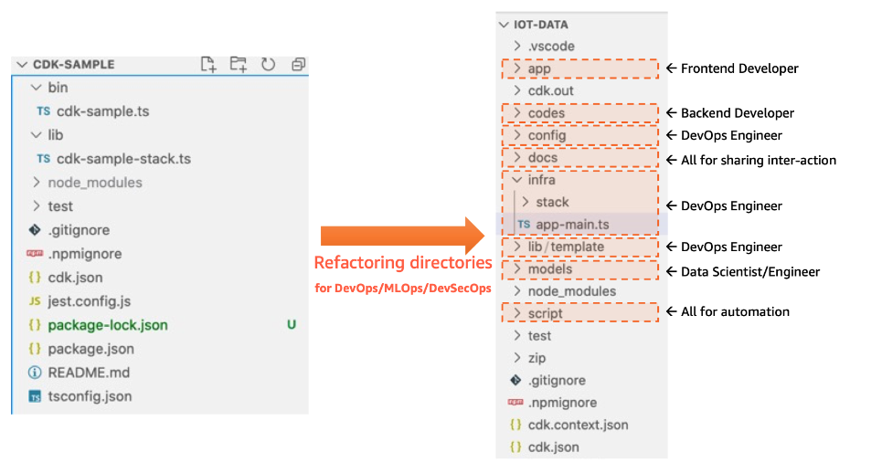

# CDK 란

{: .no_toc }

## 목차
{: .no_toc .text-delta }

1. TOC
{:toc}

---

## 글을 쓴 배경

친숙한 프로그래밍 언어로 클라우드 애플리케이션 리소스를 프로비저닝 할 수 있는 프레임 워크를 찾던 중 선택하게 되었습니다.

## 글 요약

개발자는 재사용 가능한 클라우드 구성 요소인 Constructs를 정의하고 이를 Stacks과 Apps로 구성할 수 있습니다.

**주요 개념**
* Constructs: 재사용 가능한 클라우드 구성 요소.
* Stacks: 논리적 단위의 배포 모델을 정의.
* Apps: Stacks로 구성된 애플리케이션.

**논리적 단위**

CDK 애플리케이션은 API, 데이터베이스, 모니터링 리소스와 같은 논리적 단위로 구성되어야 합니다. 이러한 단위는 Constructs로 구현되며 다음을 포함할 수 있습니다:

* 인프라: Amazon S3 버킷, Amazon RDS 데이터베이스, Amazon VPC 네트워크 등.
* 런타임 코드: AWS Lambda 함수.
* 구성 코드: 구성 스크립트 및 설정.

## 시작하기 전

1. 사용한 언어 : TypeScript ~5.2.2
2. aws-cdk : 2.126.0

---

## 1. 재활용 할 수 있는 CDK 모듈 생성하기

### 1.1 기본 원칙

개발 협업: 프로젝트 디렉토리를 역할에 따라 구성하여 협업이 용이하도록 합니다.
다중 대상 배포: 코드와 설정을 분리하여 다양한 AWS 계정/지역으로 자유롭게 배포할 수 있습니다.
스택 독립성: 스택 간 종속성을 관리하여 독립적인 배포가 가능하도록 합니다.
코드 재사용: 자주 사용되는 작업을 프레임워크로 추상화하고 쉽게 재사용할 수 있도록 합니다.

## 2. 디렉토리 구조



### 2.1 config

### 2.2 lib/template

AWS CDK에서 스택은 AWS 리소스들의 집합으로, 하나의 단위로 배포되거나 관리될 수 있습니다.

construct 디렉토리는 CDK의 "컨스트럭트"를 정의하는 곳입니다. 컨스트럭트는 CDK의 기본 빌딩 블록으로, 하나 이상의 AWS 리소스를 캡슐화하고 재사용 가능한 컴포넌트로 만듭니다. 
이 디렉토리는 특정 기능을 수행하는 더 작고 관리하기 쉬운 부분으로 리소스를 나누는 데 중점을 둡니다.

기능: 재사용 가능한 코드를 통해 프로젝트 전반에서 일관된 리소스 설정을 보장하고 개발 시간을 줄입니다.

common 디렉토리는 프로젝트 전반에서 공통적으로 사용되는 기능이나 유틸리티 함수들을 저장합니다. 이곳에는 프로젝트의 다양한 부분에서 재사용될 수 있는 코드 스니펫, 헬퍼 함수, 설정 파일 등이 포함됩니다.

lib/app-context.ts

애플리케이션 구성과 스택 초기화를 관리

AppContextError - 사용자 정의 에러 클래스
ProjectPrefix Type 열거형

icommonGuardian 인터페이스
s3 버킷을 생성하고 관리하는 유틸리티 클래스


### 2.3 script

## 2. Bamboo 시작

설치전 java 17 버전임을 확인해주세요.

```shell
$ cd <Bamboo 설치 디렉토리>
$ ./bin/start-bamboo.sh
```

Bamboo가 시작되면 다음 주소로 접속할 수 있습니다: http://localhost:8085/


## 3. Bamboo 체험판 라이센스 받기

참고 자료 : [Get a Bamboo Data Center trial license](https://confluence.atlassian.com/bamboo/get-a-bamboo-data-center-trial-license-1189482375.html)

**trial license 등록절차**

1. [my.atlassian.com](https://my.atlassian.com/license/evaluation) 로그인
2. Product - Bamboo / Organization - Data Center 입력
3. Server ID - 앞서 생성한 Bamboo 주소에서 참조 -> http://localhost:8085/


해당 과정이 마무리되면 License Key를 발급받게 됩니다.

## 4. Configure Bamboo

### 4.1 Configure instance


Jenkins와 Bamboo는 모두 CI/CD 영역에서 강력한 도구입니다. Jenkins는 오픈 소스로 널리 사용되며, Bamboo는 상업적 라이선스를 가진 도구입니다. Bamboo는 사용자 친화적인 인터페이스와 Atlassian 제품군과의 긴밀한 통합으로 인해 특히 주목받습니다. 반면 Jenkins는 플러그인의 광범위한 지원으로 높은 확장성을 자랑합니다.


참고자료 : https://www.jenkins.io/blog/2021/05/20/configure-plugins-with-jcasc/
