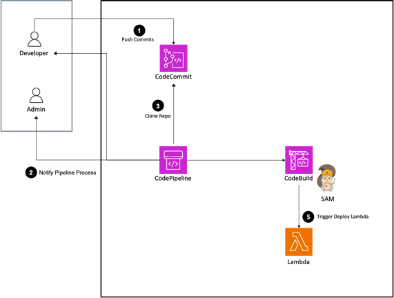
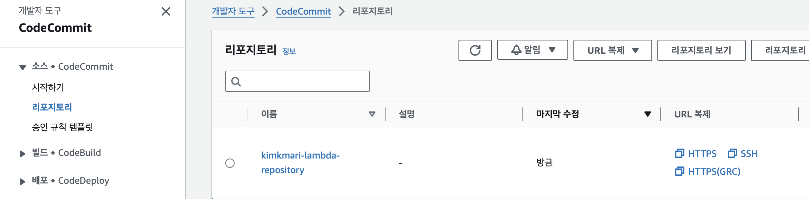
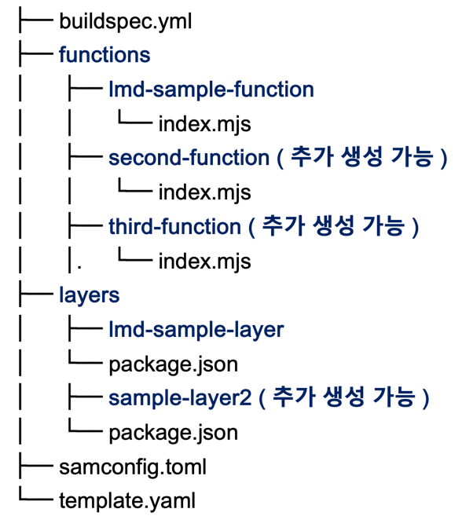
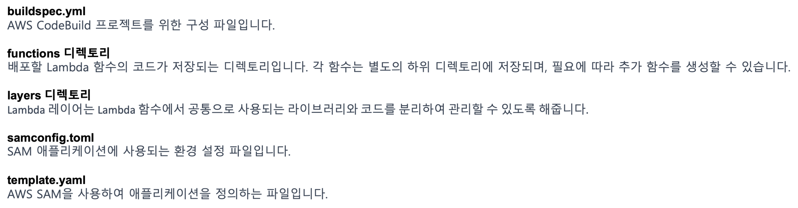

# AWS CodePipeline을 이용해 SAM으로 Lambda 배포하기

AWS의 Lambda 함수 배포 과정을 자동화하는 방법을 소개합니다. 
AWS CodePipeline과 SAM(Serverless Application Model)을 활용해 
코드의 변경이 있을 때 자동으로 배포 프로세스가 실행되도록 하는 방법을 공유합니다.


{: .no_toc }

## 목차
{: .no_toc .text-delta }

1. TOC
{:toc}

---

## 글을 쓴 배경

Lambda 함수를 Git으로 관리하고, 배포 과정을 자동화하는 방법을 고민하던 중 작성되었습니다.

## 글 요약

AWS CodePipeline은 소스 스테이지로 지정된 AWS CodeCommit의 소스 변경 사항을 감지하고,

CodeBuild를 빌드 스테이지를 사용하여 SAM을 통해 Lambda 함수를 배포하는 과정을 소개합니다.

Lambda 함수 코드와 관련 파이프라인 구성 파일은 모두 AWS CodeCommit 레포지토리에 저장되어 관리됩니다.



**AWS CodePipeline** : AWS에서 제공하는 통합 CI/CD 서비스 입니다. 코드의 변경 사항을 자동으로 배포할 수 있습니다.

**AWS SAM** : AWS 서버리스 애플리케이션의 구축 및 배포를 돕는 프레임워크입니다. SAM은 배포 시 AWS CloudFormation 템플릿으로 변환되어, Lambda, API Gateway, DynamoDB 등 AWS 서버리스 서비스의 구성을 코드 형태로 관리할 수 있습니다.

## 시작하기 전

AWS Code Series 및 AWS Lambda, SAM에 대한 기본 지식이 필요합니다.

사용한 레포지토리 주소 

---

## 1. AWS CodeCommit Repository 구성

소스 코드 저장소로 AWS CodeCommit을 사용합니다. 
CodeCommit은 AWS에서 제공하는 GIT 형상 관리 서비스로, 프라이빗 레포지토리를 제공합니다.



### 1.1 전체 소스코드 구조

| 실제 프로젝트 파일 구조 | 파일 및 디렉토리 구조 간단 설명      |
|-|-------------------------|
||  |


### 2. buildspec.yml 구성

`buildspec.yml`은 CodeBuild 프로젝트 구성파일입니다.

```yaml
version: 0.2

env:
  shell: bash

phases:
  install:
    runtime-versions:
      nodejs: 20
    commands:
  build:
    commands:
      - echo Build started on `date`
      - ls -alh ./
      - sam build
      - sam deploy --no-confirm-changeset --no-progressbar --no-fail-on-empty-changeset
```

#### 2.1 buildspec.yml 상세설명

**2.1.1 `sam build`**

template.yaml 파일에 정의된 AWS 서버리스 애플리케이션의 빌드 작업을 수행합니다.

SAM은 템플릿에 정의된 각 AWS 리소스(예: Lambda 함수)에 필요한 종속성을 설치하고, 이를 포함한 배포 패키지를 구성합니다.

Node.js를 예로 들면, npm install을 통해 필요한 라이브러리를 설치하는 것과 유사합니다.

**2.1.2 `sam deploy --no-confirm-changeset --no-progressbar --no-fail-on-empty-changeset`**

* `sam build`를 통해 생성된 배포 패키지를 `sam deploy`는 AWS CloudFormation 스택으로 배포합니다. 여러 하위 옵션들과 함께 사용될 수 있습니다.

* `--no-confirm-changeset`: SAM이 AWS CloudFormation이 리소스를 생성 혹은 업데이트할 때 사용자의 확인 절차 없이 바로 진행합니다.

* `--no-progressbar`: 배포 프로세스 progress bar을 표시하지 않도록 합니다.

* `--no-fail-on-empty-changeset`: 만약 변경 사항이 없는 경우에도 배포 프로세스가 실패하지 않도록 합니다.

```bash
  - sam build
  - sam deploy --no-confirm-changeset --no-progressbar --no-fail-on-empty-changeset
 ```

### 3. samconfig.toml 구성

`samconfig.toml`은 sam deploy 실행 시 포함되는 AWS SAM CLI 명령의 파라미터 값을 저장하고, 
명령 실행 시 그 내용이 적용할 수 있게 해주는 파일입니다. sam deploy 명령을 간소화 해줍니다.

toml 혹은 yaml 형식도 지원됩니다. 

만약 명령줄에서 직접 제공된 파라미터 값이 있다면 그 값이 구성 파일보다 우선합니다.

`sam deploy --guided` 명령어를 통해 애플리케이션을 배포하는 데 필요한 설정을 대화형으로 수행할 수 있습니다. 설정된 값은 samconfig.toml에 저장됩니다.

참조 문서 : [AWS SAMCLI구성 파일](https://docs.aws.amazon.com/ko_kr/serverless-application-model/latest/developerguide/serverless-sam-cli-config.html)

```toml
version=0.1
[default.global.parameters]
stack_name = "common-stack"

[environment.command.parameters]
option = "parameter value"

[default.deploy.parameters]
stack_name = "stack-lambda"
s3_bucket = "duck's-s3"
s3_prefix = ""
region = "ap-northeast-2"
capabilities = "CAPABILITY_IAM"

[default.build.parameters]
no_beta_features = true
```

#### 3.1 samconfig.toml 상세설명

##### 3.1.1 `[default.global.parameters]`

모든 SAM 명령에 적용되는 기본 파라미터를 지정합니다.

* stack_name - AWS CloudFormation 스택 이름을 정의합니다.

template.yaml 파일에 정의된 AWS 서버리스 애플리케이션의 빌드 작업을 수행합니다.

version: 파일 형식의 버전을 명시합니다.
[default.global.parameters]: 모든 SAM 명령에 적용되는 전역 설정을 정의합니다.
stack_name: 기본적으로 사용될 AWS CloudFormation 스택의 이름을 설정합니다.
배포 설정 [default.deploy.parameters]
stack_name: 배포할 때 사용될 CloudFormation 스택의 이름입니다.
s3_bucket: SAM 패키지를 업로드할 Amazon S3 버킷의 이름입니다.
s3_prefix: S3 버킷 내에서 SAM 패키지를 저장할 경로(프리픽스)입니다.
region: 배포 대상 AWS 리전을 지정합니다.
confirm_changeset: 배포 전 변경 세트를 확인할지 여부를 결정합니다. (true 설정 시 확인 절차 필요)
capabilities: CloudFormation 스택 생성 시 필요한 권한을 명시합니다. (CAPABILITY_IAM은 IAM 리소스 생성 권한을 부여)
빌드 설정 [default.build.parameters]
no_beta_features: 베타 기능의 사용 여부를 결정합니다. (true로 설정 시 베타 기능 비활성화)