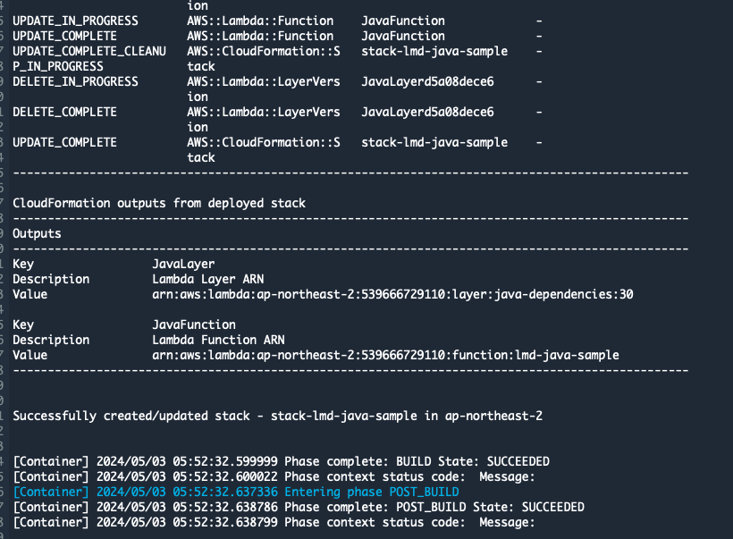
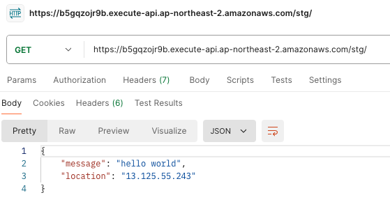

# AWS SAM을 이용해 Lambda로 JAVA 어플리케이션 배포하기

{: .no_toc }

## 목차
{: .no_toc .text-delta }

1. TOC
{:toc}

---

## 글을 쓴 배경

이 글에서는 AWS SAM(Serverless Application Model)을 이용하여 Lambda로 Java 어플리케이션을 배포하는 과정을 설명합니다.

## 글 요약

AWS SAM과 AWS CodeBuild 를 이용해 Java Application을 Lambda에 배포하고 API Gateway를 통해 Lambda를 호출하는 과정을 설명합니다.

## 시작하기 전

* **CodeBuild 빌드 환경 사용**: public.ecr.aws/sam/build-java21:1.115.0-20240411212300-x86_64 ([ECR Public Gallery](https://gallery.ecr.aws/sam/build-java21))
* **Java 버전**: Java 21
* **sam 버전**: SAM CLI, version 1.108.0

---

## 1. AWS SAM과 AWS Lambda 소개

**AWS SAM**

AWS SAM은 AWS CloudFormation의 확장 프레임워크입니다. 개발자는 YAML 혹은 JSON 템플릿으로 리소스를 정의할 수 있으며, 이 템플릿은 AWS CloudFormation으로 자동 변환되어 리소스가 프로비저닝됩니다.

SAM을 사용함으로써 개발자는 Lambda 코드의 버전 관리를 Git과 같은 형상관리 도구를 사용하여 수행할 수 있으며, Lambda 배포를 Git 레포지토리에 코드를 푸시하는 과정으로 수행할 수 있습니다.

관련 문서 : [AWS Serverless Application Model (AWS SAM) 란 무엇입니까?](https://docs.aws.amazon.com/ko_kr/serverless-application-model/latest/developerguide/what-is-sam.html)

**AWS Lambda**

AWS Lambda는 코드를 서버 없이 실행할 수 있게 해주는 서비스입니다.

관련 문서 : [AWS Lambda이란 무엇인가요?](https://docs.aws.amazon.com/ko_kr/lambda/latest/dg/welcome.html)

## 2. 서버리스 어플리케이션 예제

다음은 Lambda에서 사용되는 Java 함수 코드입니다

### 2.1 function code

```java
package example;

import com.amazonaws.services.lambda.runtime.Context;
import com.amazonaws.services.lambda.runtime.LambdaLogger;
import com.amazonaws.services.lambda.runtime.RequestHandler;
import com.amazonaws.services.lambda.runtime.events.APIGatewayProxyRequestEvent;
import com.amazonaws.services.lambda.runtime.events.APIGatewayProxyResponseEvent;
import software.amazon.lambda.powertools.metrics.Metrics;
import software.amazon.lambda.powertools.tracing.Tracing;

import java.io.BufferedReader;
import java.io.IOException;
import java.io.InputStreamReader;
import java.net.URL;
import java.util.HashMap;
import java.util.Map;
import java.util.stream.Collectors;

import static software.amazon.lambda.powertools.tracing.CaptureMode.DISABLED;

public class Handler implements RequestHandler<APIGatewayProxyRequestEvent, APIGatewayProxyResponseEvent> {

    @Tracing(captureMode = DISABLED)
    @Metrics(captureColdStart = true)
    @Override
    public APIGatewayProxyResponseEvent handleRequest(final APIGatewayProxyRequestEvent input, final Context context) {
        LambdaLogger logger = context.getLogger();
        logger.log("Received request: " + input.toString());

        Map<String, String> headers = new HashMap<>();
        headers.put("Content-Type", "application/json");
        headers.put("X-Custom-Header", "application/json");

        APIGatewayProxyResponseEvent response = new APIGatewayProxyResponseEvent()
                .withHeaders(headers);

        try {
            final String pageContents = this.getPageContents("https://checkip.amazonaws.com");
            String output = String.format("{ \"message\": \"hello world\", \"location\": \"%s\" }", pageContents);
            logger.log("Response body: " + output);

            return response
                    .withStatusCode(200)
                    .withBody(output);

        } catch (IOException e) {
            logger.log("Error: " + e.getMessage());
            return response
                    .withBody("{}")
                    .withStatusCode(500);
        }
    }

    @Tracing(namespace = "getPageContents")
    private String getPageContents(String address) throws IOException {
        URL url = new URL(address);
        try (BufferedReader br = new BufferedReader(new InputStreamReader(url.openStream()))) {
            return br.lines().collect(Collectors.joining(System.lineSeparator()));
        }
    }
}
```

### 2.2 function code 상세 설명

이 AWS Lambda 함수는 API Gateway로부터 오는 HTTP 요청을 처리합니다. 
Handler 클래스에 정의된 handleRequest 메소드를 통해 이벤트를 수신하고 처리 결과를 반환합니다.

**클래스 및 인터페이스 선언**

`Handler` 클래스는 [RequestHandler](https://github.com/aws/aws-lambda-java-libs/blob/main/aws-lambda-java-core/src/main/java/com/amazonaws/services/lambda/runtime/RequestHandler.java) 
인터페이스를 구현합니다. 이 인터페이스는 두 개의 제네릭 파라미터를 받으며, AWS Lambda에서 이벤트를 처리할 수 있도록 합니다.

* **RequestHandler** : Lambda 함수의 로직을 구현하는 핸들러입니다.
* **[APIGatewayProxyRequestEvent](https://github.com/aws/aws-lambda-java-libs/blob/main/aws-lambda-java-events/src/main/java/com/amazonaws/services/lambda/runtime/events/APIGatewayProxyRequestEvent.java)** : API Gateway로부터 받은 HTTP 요청 데이터를 담고 있습니다.
* **[APIGatewayProxyResponseEvent](https://github.com/aws/aws-lambda-java-libs/blob/main/aws-lambda-java-events/src/main/java/com/amazonaws/services/lambda/runtime/events/APIGatewayProxyResponseEvent.java)** : 처리 결과를 API Gateway로 반환할 때 사용하는 객체입니다.

**어노테이션 활용**

* `@Tracing`: AWS X-Ray와 통합하여 Lambda 애플리케이션의 추적, 디버깅 및 최적화를 지원합니다. `captureMode = DISABLED` 설정은 자동 추적을 비활성화합니다.
* `@Metrics`: 성능 메트릭을 수집하는 데 사용됩니다. `captureColdStart = true` 옵션으로 콜드 스타트 시 발생하는 지연 시간과 관련 데이터를 캡처합니다.

> 콜드 스타트란?
> 
> 배포 후 일정 기간동안 사용되지 않아 함수가 내려간 후 다시 시작될 때 혹은 새 인스턴스로 처음 시작될 때 때 주로 발생됩니다. 이 때 지연이 발생될 수 있으며 captureColdStart 옵션은 이 지연시간을 포함한 세부정보를 기록합니다.

**핸들러 메인 메소드**

`handleRequest` 메소드는 API Gateway로부터 받은 HTTP 요청을 처리하고 응답을 반환합니다. 메소드는 `APIGatewayProxyRequestEvent`와 `Context` 객체를 매개변수로 받아 실행됩니다.

* Context 객체: Lambda 실행 환경에 대한 정보를 제공하며, 로깅 등의 기능에 접근할 수 있습니다.
* LambdaLogger: 요청을 로깅하여 CloudWatch에서 확인할 수 있게 합니다.
* 응답 헤더 설정: 응답에 `Content-Type`과 `X-Custom-Header`를 설정하여 응답이 JSON 형식임을 명시합니다.

**외부 리소스 접근**

`getPageContents` 메소드: 외부 URL에서 데이터를 가져오는 기능을 수행합니다. 이 메소드는 https://checkip.amazonaws.com에서 IP 주소를 조회하며, 이 정보를 응답에 포함시킵니다.

## 3. AWS SAM을 이용한 Java Application 빌드 및 배포

AWS SAM은 Java 언어를 사용할 때 Maven이나 Gradle과 같은 표준 Java 빌드 도구를 자동으로 활용하여 프로젝트를 배포합니다.

### 3.1 template code

다음은 SAM 에서 Lambda 함수를 배포 할 때 사용하는 template.yaml 파일입니다.

```yaml
AWSTemplateFormatVersion: '2010-09-09'
Transform: AWS::Serverless-2016-10-31
Description: A simple AWS Lambda application using Java with a Layer.

Globals:
  Function:
    Runtime: java21
    Timeout: 10  # Timeout in seconds
    MemorySize: 512
    Architectures:
      - x86_64
Parameters:
  LambdaFunctionName:
    Type: String
    Default: lmd-java-sample
    Description: The name of the Lambda function.

Resources:
  JavaFunction:
    Type: AWS::Serverless::Function
    Properties:
      FunctionName: !Ref LambdaFunctionName
      Handler: example.Handler::handleRequest
      CodeUri: function/
      SnapStart:
        ApplyOn: PublishedVersions
      Role: arn:aws:iam::539666729110:role/kimkm-lambda-role
      Layers:
        - !Ref JavaLayer
    Metadata:
      BuildMethod: makefile

  JavaLayer:
    Type: AWS::Serverless::LayerVersion
    Properties:
      LayerName: "java-dependencies"
      Description: "Java libraries required for the lambda function"
      ContentUri: layer/
      RetentionPolicy: 'Delete'
    Metadata:
      BuildMethod: java21

Outputs:
  JavaFunction:
    Description: "Lambda Function ARN"
    Value: !GetAtt JavaFunction.Arn
  JavaLayer:
    Description: "Lambda Layer ARN"
    Value: !Ref JavaLayer

```

### 3.2 SAM Template의 기본 구성

AWS SAM은 template.yaml 파일을 통해 실행되며, 본 예제 파일에서는 Lambda 함수와 관련된 설정을 정의합니다. 

#### 3.2.1 표준 빌드 방식

AWS SAM CLI는 `sam build` 명령어를 실행할 때, 자동으로 template.yaml 파일에서 지정된 CodeUri 경로에서 Java 프로젝트의 `pom.xml` 혹은 `build.gradle` 파일을 찾아 빌드 과정을 진행합니다.

* Maven 사용 시: `mvn clean install` 명령을 사용하여 의존성을 해결하고, 실행 가능한 jar 파일을 컴파일합니다.
* Gradle 사용 시: `gradle build` 명령을 사용하여 동일한 작업을 수행합니다.

이러한 빌드 과정은 template.yaml 파일내 있는 `BuildMethod: java21` 옵션을 통해 AWS SAM이 자동으로 처리합니다.

#### 3.2.2 Makefile을 이용한 커스텀 빌드 설정

Java 애플리케이션의 경우, 특히 AWS Lambda에 배포될 때, 종종 추가적인 빌드 설정이 필요합니다. Makefile을 통해 사용자가 직접 빌드 과정을 정의할 수 있습니다.

```Makefile
build-JavaFunction:
	mkdir -p "$(ARTIFACTS_DIR)/lib"
	mvn clean package
	cp -rf ./target/*.jar "$(ARTIFACTS_DIR)/lib/"
	rm -rf ./target
```

위 Makefile 스크립트는 아티팩트를 정리하고, jar 파일을 컴파일 한다음, lambda 배포를 위해 지정된 위치에 복사합니다.

명령어에서 사용된 `ARTIFACTS_DIR`는 AWS SAM이 빌드 중에 사용하는 환경 변수로, 빌드된 파일들을 저장할 경로를 지정합니다.

lib 폴더는 Lambda에서 지정한 Java 용 라이브러리를 저장하는데 사용하는 디렉토리 명칭입니다. 폴더 명을 바꾸면 안됩니다.

#### 3.3 Lambda Layer를 통한 의존성 관리

`AWS::Serverless::LayerVersion`선언은 Lambda 함수가 실행 시 필요한 의존성을 제공합니다. 이는 Lambda 환경에서 공통 의존성을 제공하여 각 함수의 패키지 크기를 줄이는 데 사용됩니다.

#### 3.4 pom.xml

Java 빌드 과정에서 모든 소스 코드와 의존성은 하나의 jar 파일 안에 포함되어 Lambda에 배포됩니다.

AWS Lambda에서 Maven을 이용하여 Java 함수를 구현할 때, pom.xml 파일은 Java 프로젝트의 구성을 정의하고, 필요한 라이브러리들을 관리합니다.

##### 3.4.1 function/pom.xml

```xml
<project xmlns="http://maven.apache.org/POM/4.0.0" xmlns:xsi="http://www.w3.org/2001/XMLSchema-instance"
  xsi:schemaLocation="http://maven.apache.org/POM/4.0.0 http://maven.apache.org/maven-v4_0_0.xsd">
    <modelVersion>4.0.0</modelVersion>
    <groupId>com.example</groupId>
    <artifactId>java-function</artifactId>
    <version>1.0-SNAPSHOT</version>
    <name>java-function</name>

    <properties>
        <project.build.sourceEncoding>UTF-8</project.build.sourceEncoding>
        <maven.compiler.source>21</maven.compiler.source>
        <maven.compiler.target>21</maven.compiler.target>
        <aws.java.sdk.version>2.25.16</aws.java.sdk.version>
    </properties>

    <dependencyManagement>
        <dependencies>
            <dependency>
                <groupId>software.amazon.awssdk</groupId>
                <artifactId>bom</artifactId>
                <version>${aws.java.sdk.version}</version>
                <type>pom</type>
                <scope>import</scope>
            </dependency>
        </dependencies>
    </dependencyManagement>

    <dependencies>

        <dependency>
            <groupId>com.example</groupId>
            <artifactId>java-layer</artifactId>
            <version>1.0-SNAPSHOT</version>
            <scope>provided</scope>
        </dependency>

    </dependencies>

</project>
```

##### 3.4.3 layer/pom.xml

```xml
<project xmlns="http://maven.apache.org/POM/4.0.0" xmlns:xsi="http://www.w3.org/2001/XMLSchema-instance"
         xsi:schemaLocation="http://maven.apache.org/POM/4.0.0 http://maven.apache.org/maven-v4_0_0.xsd">
    <modelVersion>4.0.0</modelVersion>
    <groupId>com.example</groupId>
    <artifactId>java-layer</artifactId>
    <packaging>jar</packaging>
    <version>1.0-SNAPSHOT</version>
    <name>java-layer</name>

    <properties>
        <project.build.sourceEncoding>UTF-8</project.build.sourceEncoding>
        <maven.compiler.source>21</maven.compiler.source>
        <maven.compiler.target>21</maven.compiler.target>
    </properties>

    <dependencies>

        <dependency>
            <groupId>com.amazonaws</groupId>
            <artifactId>aws-lambda-java-core</artifactId>
            <version>1.2.3</version>
        </dependency>

        <dependency>
            <groupId>org.apache.groovy</groupId>
            <artifactId>groovy</artifactId>
            <version>4.0.15</version>
        </dependency>

        <dependency>
            <groupId>com.amazonaws</groupId>
            <artifactId>aws-lambda-java-events</artifactId>
            <version>3.11.5</version>
        </dependency>

        <dependency>
            <groupId>software.amazon.lambda</groupId>
            <artifactId>powertools-tracing</artifactId>
            <version>1.12.3</version>
        </dependency>

        <dependency>
            <groupId>software.amazon.lambda</groupId>
            <artifactId>powertools-metrics</artifactId>
            <version>1.12.3</version>
        </dependency>

    </dependencies>

    <build>
        <plugins>
            <plugin>
                <groupId>org.apache.maven.plugins</groupId>
                <artifactId>maven-compiler-plugin</artifactId>
                <version>3.13.0</version>
                <configuration>
                    <source>21</source>
                    <target>21</target>
                    <release>21</release>
                </configuration>
            </plugin>

            <plugin>
                <groupId>org.apache.maven.plugins</groupId>
                <artifactId>maven-shade-plugin</artifactId>
                <version>3.5.2</version>
                <configuration>
                    <createDependencyReducedPom>false</createDependencyReducedPom>
                </configuration>
                <executions>
                    <execution>
                        <phase>package</phase>
                        <goals>
                            <goal>shade</goal>
                        </goals>
                    </execution>
                </executions>
            </plugin>
        </plugins>
    </build>

</project>
```

##### 3.4.4 pom.xml 주요 부분 상세 설명

1. provided scope

```xml
<dependency>
    <groupId>com.example</groupId>
    <artifactId>java-layer</artifactId>
    <version>1.0-SNAPSHOT</version>
    <scope>provided</scope>
</dependency>
```

* **역할**: 람다 호출 시 런타임이 람다 layer에서 의존성을 제공받기 때문에 람다에 배포할 패키지에 포함시키지 않습니다.
* **중요성**: 이 설정은 배포 패키지의 크기를 줄이는 데 큰 도움을 주어, 배포 시간과 리소스 사용을 최소화하며, Lambda 함수의 cold start 시간을 개선할 수 있습니다. 또한, 의존성 충돌을 피하는데도 도움이 됩니다.

2. Maven Shade Plugin
```xml
<plugin>
    <groupId>org.apache.maven.plugins</groupId>
    <artifactId>maven-shade-plugin</artifactId>
    <version>3.5.2</version>
    <configuration>
        <createDependencyReducedPom>false</createDependencyReducedPom>
    </configuration>
    <executions>
        <execution>
            <phase>package</phase>
            <goals>
                <goal>shade</goal>
            </goals>
        </execution>
    </executions>
</plugin>
```

* **역할**: Maven 프로젝트에서 하나의 실행 가능한 jar 파일을 생성하는 데 사용됩니다. 람다 배포시 단일 실행 파일로 배포해야합니다.

## 4. samconfig.toml

SAM 프로젝트를 배포할 때 사용되는 설정 정보를 포함하는 파일입니다. 

```toml
version=0.1
[default.global.parameters]
stack_name = "common-stack"

[default.deploy.parameters]
stack_name = "stack-lmd-java-sample"
s3_bucket = "kimkmari-s3"
s3_prefix = "template/lmd-java-sample"
region = "ap-northeast-2"
confirm_changeset = false
capabilities = "CAPABILITY_IAM"

[default.build.parameters]
no_beta_features = true
```

## 5. CodeBuild 이용한 CI/CD 구성

codebuild를 이용해 SAM CLI를 통해 Lambda를 배포할 수 있습니다.

### 5.1 buildspec.yml

```yaml
version: 0.2

env:
  shell: bash

phases:
  install:
    commands:
      - java -version
      - cat /etc/os-release
      - sam --version
  build:
    commands:
      - echo Build started on `date`
      - ls -alh ./
      - sam build
      - sam deploy --no-progressbar --no-fail-on-empty-changeset
```

## 5. Lambda 배포 확인

codebuild project 수행 확인



api gateway를 이용한 lambda 호출




