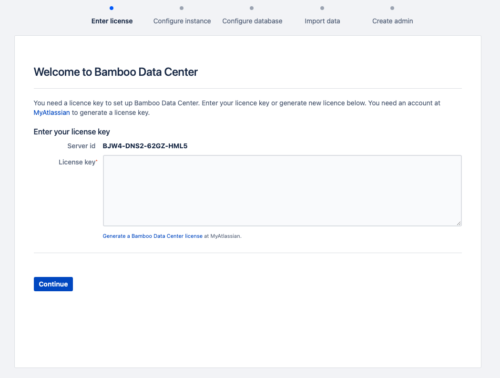
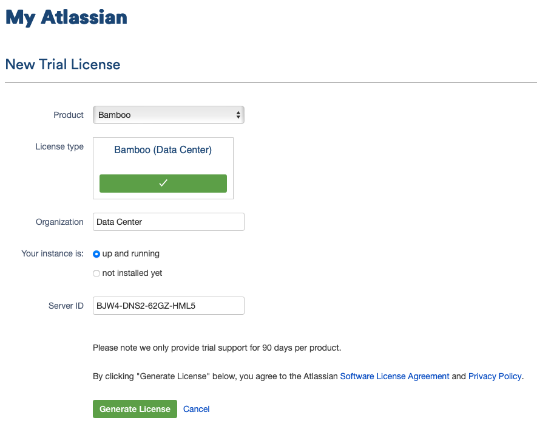

# Bamboo

Bamboo는 Atlassian에 의해 개발된 CI/CD 도구입니다.

{: .no_toc }

## 목차
{: .no_toc .text-delta }

1. TOC
{:toc}

---

## 글 요약


## 시작하기 전

Bamboo instance 구성정보
- OS: 다른 Linux OS를 사용하셔도 무방합니다. 저는 Mac Local에서 진행했습니다.
- JDK: amazon-corretto-17
- Bamboo: 9.6

Bamboo 

참고자료 : [supported platforms](https://confluence.atlassian.com/bamboo/supported-platforms-289276764.html)

---

# Bamboo 로컬에 설치하기

참고자료 : [Installing Bamboo on Mac OS X](https://confluence.atlassian.com/bamboo/installing-bamboo-on-mac-os-x-289276789.html)

## Bamboo 파일 다운로드 하기

- [download the file link](https://www.atlassian.com/software/bamboo/download)

tar.gz for MacOS or Linux distributions.

## Bamboo 홈 위치 지정

Bamboo 데이터가 저장될 홈 디렉토리를 지정합니다.

**설치 파일내 bamboo-init.properties 파일 수정**
- `<Bamboo 설치 디렉토리>/atlassian-bamboo/WEB-INF/classes/ 내의 bamboo-init.properties` 파일 수정 필요
- bamboo.home 줄의 주석 해제후 아래와 같이 홈 디렉토리의 절대 경로를 제공합니다.

```properties
## You can specify your bamboo.home and bamboo.shared.home property here or in your system environment variables.

#Local Bamboo home. If running in HA (multi-node) mode, you need to provide a unique, not shared, home directory for node specific content

bamboo.home=/Users/kimkmari/bamboo

#If running in HA mode, you need to provide a shared home directory that will be used by all nodes
#It is allowed to mount this shared directory as a subdirectory of bamboo.home
#Can be left undefined when running in single node mode, in which case the data will be stored in ${bamboo.home}/shared

#bamboo.shared.home=
```

# Bamboo 시작

설치전 java 17 버전임을 확인해주세요.

```shell
$ cd <Bamboo 설치 디렉토리>
$ ./bin/start-bamboo.sh
```

Bamboo가 시작되면 다음 주소로 접속할 수 있습니다: http://localhost:8085/



# Bamboo 체험판 라이센스 받기

참고 자료 : [Get a Bamboo Data Center trial license](https://confluence.atlassian.com/bamboo/get-a-bamboo-data-center-trial-license-1189482375.html)

**trial license 등록절차**

1. [my.atlassian.com](https://my.atlassian.com/license/evaluation) 로그인
2. Product - Bamboo / Organization - Data Center 입력
3. Server ID - 앞서 생성한 Bamboo 주소에서 참조 -> http://localhost:8085/



해당 과정이 마무리되면 License Key를 발급받게 됩니다.

# Configure Bamboo

## Configure instance

Jenkins와 Bamboo는 모두 CI/CD 영역에서 강력한 도구입니다. Jenkins는 오픈 소스로 널리 사용되며, Bamboo는 상업적 라이선스를 가진 도구입니다. Bamboo는 사용자 친화적인 인터페이스와 Atlassian 제품군과의 긴밀한 통합으로 인해 특히 주목받습니다. 반면 Jenkins는 플러그인의 광범위한 지원으로 높은 확장성을 자랑합니다.


참고자료 : https://www.jenkins.io/blog/2021/05/20/configure-plugins-with-jcasc/
