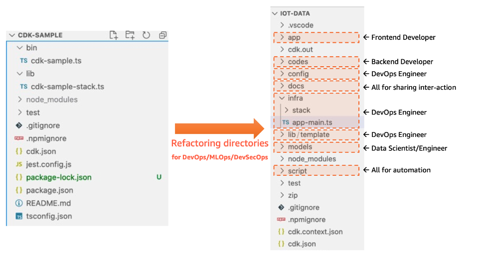

# TypeScript CDK로 재사용 가능한 모듈 구조 작성하기 - cdk init 1편

{: .no_toc }

## 목차
{: .no_toc .text-delta }

1. TOC
{:toc}

---

## 글을 쓴 배경

AWS Cloud Development Kit (CDK)를 사용하여 재사용 가능한 모듈 구조를 작성하는 방법을 공유하고자 합니다.
기존 bootstrap으로 만든 구조에서는 배포할 스택에 하드코딩된 상세 정보들이 많아 이를 재사용하기 쉽지 않았습니다.
또한 배포 중 context를 이용한 리소스 공유 등 고도화된 런타임 설정이 요구되었습니다.
이를 개선하기 위해 config 파일을 사용하는 방법을 고안하였고, 해당 구조로 배포를 시도하게 되었습니다. 

## 글 요약

이 글에서는 `cdk init` 명령어로 생성되는 기본 CDK 프로젝트 구조와, 
이를 개선하여 모듈화된 CDK 프로젝트 구조를 작성하는 방법을 설명합니다.
또한, 디렉토리 구조를 조직화하여 각 역할에 맞게 파일을 배치하는 방법을 다룹니다.

## 시작하기 전

AWS CDK와 TypeScript에 대한 기본 지식이 필요합니다.

---

## 1. cdk init

**기본 CDK 구조**

`cdk init` 명령어를 사용하여 생성된 기본 CDK 프로젝트는 다음과 같은 구조를 가집니다

`lib` 디렉토리에 배포할 스택을 관리하고, `bin` 디렉토리에 있는 `app.ts` 파일을 이용해 배포합니다.

```perl
my-cdk-app/
├── bin/
│   └── my-cdk-app.ts
├── lib/
│   └── my-cdk-app-stack.ts
├── node_modules/
├── .gitignore
├── cdk.json
├── package.json
├── tsconfig.json
└── README.md
```

### 1.1 기본 CDK 앱 예제

`bin/my-cdk-app.ts`
```typescript
#!/usr/bin/env node
import 'source-map-support/register';
import * as cdk from 'aws-cdk-lib';
import { TempStack } from '../lib/temp-stack';

const app = new cdk.App();
new TempStack(app, 'TempStack', {
  // env: { account: process.env.CDK_DEFAULT_ACCOUNT, region: process.env.CDK_DEFAULT_REGION },
  // env: { account: '123456789012', region: 'us-east-1' },
});
```

`lib/temp-stack.ts`
```typescript
import * as cdk from 'aws-cdk-lib';
import { Construct } from 'constructs';
// import * as sqs from 'aws-cdk-lib/aws-sqs';

export class TempStack extends cdk.Stack {
  constructor(scope: Construct, id: string, props?: cdk.StackProps) {
    super(scope, id, props);

    // The code that defines your stack goes here

    // example resource
    // const queue = new sqs.Queue(this, 'TempQueue', {
    //   visibilityTimeout: cdk.Duration.seconds(300)
    // });
  }
}
```

## 2. 모듈화된 CDK 구조

다양한 환경에서 배포하고, 스택 간의 의존성 관리등을 개선한 구조입니다. 코드 재사용성을 극대화하는데 목표를 두었습니다.

```perl
├── README.md
├── bin
│   └── app.ts
├── cdk.context.json
├── cdk.json
├── config
│   ├── app-config-demo.json
│   ├── config-sample.json
├── infra
│   ├── pattern
│   └── stack
│       ├── cfn-template
│           └── sample-cfn-vpc.yaml
├── jest.config.js
├── lib
│   ├── app-config.ts
│   └── app-context.ts
├── package-lock.json
├── package.json
├── script
│   ├── db
│   │   └── database_helloworld.sql
│   ├── deploy_stacks.sh
│   ├── destroy_stacks.sh
│   └── setup_initial.sh
├── setup_initial.sh
└── tsconfig.json
```

**기본 구조와 변경된 구조 비교도**



### 2.1 디렉토리 구조

* **bin 디렉토리**: 애플리케이션의 진입점 파일을 포함합니다.
* **infra 디렉토리**: 리소스 배포 스택을 포함합니다.
* **lib 디렉토리**: 의존성과 관련된 코드를 포함합니다.
* **config 디렉토리**: 환경 설정 파일을 포함합니다.
* **scripts 디렉토리**: 배포 스크립트를 포함합니다.

### 2.3 모듈화된 CDK 구조의 장점

* **유지보수 용이성**: 각 디렉토리와 파일이 역할에 따라 나누어져 있어 관리가 용이합니다.
* **재사용성**: 설정 파일을 분리하여 여러 환경에서 재사용할 수 있습니다.
* **유연성**: 컨텍스트를 이용하여 런타임 중 설정 값을 동적으로 변경할 수 있습니다.

## 3. 왜 모듈화가 필요한가?

기존의 구조에서는 스택을 정의할 때 하드코딩된 값들이 많아 재 사용이 어려웠습니다. 아래는 VPC와 ElastiCach를 설정하는 예제입니다.

```typescript
import * as cdk from "aws-cdk-lib";
import { Construct } from "constructs";
import * as EC2 from "aws-cdk-lib/aws-ec2";
import { aws_elasticache as ElastiCache } from "aws-cdk-lib";
import { SecurityGroup, Peer, Port } from "aws-cdk-lib/aws-ec2";

export default class ElasticacheNodeRedisStack extends cdk.Stack {
    private vpc: EC2.Vpc;

    constructor(scope: Construct, id: string, props?: cdk.StackProps) {
        super(scope, id, props);
        const elastiCacheRedisPort = 6379;
        const elastiCacheVPCName = "ElastiCacheVPC";
        const elastiCacheSubnetIds = [];
        const elastiCacheSubnetGroupName = "ElastiCacheSubnetGroup";
        const elastiCacheSecurityGroupName = "ElastiCacheSecurityGroup";
        const elastiCacheRedisName = "ElastiCacheNodeRedis";

        this.vpc = new EC2.Vpc(this, elastiCacheVPCName.toLowerCase());

        for (const subnet of this.vpc.privateSubnets) {
            console.log(`Private Subnet Id: ${subnet.subnetId}`);
            elastiCacheSubnetIds.push(subnet.subnetId);
        }

        const elastiCacheSubnetGroup = new ElastiCache.CfnSubnetGroup(
            this,
            elastiCacheSubnetGroupName.toLowerCase(),
            {
                description: "ElastiCache Subnet Group CDK",
                cacheSubnetGroupName: elastiCacheSubnetGroupName.toLowerCase(),
                subnetIds: elastiCacheSubnetIds,
            }
        );

        const elastiCacheSecurityGroup = new SecurityGroup(
            this,
            elastiCacheSecurityGroupName.toLowerCase(),
            {
                vpc: this.vpc,
                allowAllOutbound: true,
                description: "ElastiCache Security Group CDK",
                securityGroupName: elastiCacheSecurityGroupName.toLowerCase(),
            }
        );
        elastiCacheSecurityGroup.addIngressRule(
            Peer.anyIpv4(),
            Port.tcp(elastiCacheRedisPort),
            "ElastiCache for Redis Port"
        );

        const elastiCacheRedis = new ElastiCache.CfnCacheCluster(
            this,
            elastiCacheRedisName.toLowerCase(),
            {
                clusterName: elastiCacheRedisName.toLowerCase(),
                cacheNodeType: "cache.t3.micro",
                engine: "redis",
                engineVersion: "6.x",
                numCacheNodes: 1,
                cacheSubnetGroupName: elastiCacheSubnetGroup.ref,
                vpcSecurityGroupIds: [elastiCacheSecurityGroup.securityGroupId],
                cacheParameterGroupName: "default.redis6.x",
                tags: [{
                    key: "Environment",
                    value: "production"
                }],
            }
        );
    }
}
```

### 3.1 기존 구조의 문제점

* **하드코딩된 설정**: VPC, Subnet, Security Group 등의 설정이 하드코딩되어 있어 재사용이 어렵습니다.
* **유연성 부족**: 환경에 따른 설정 변경이 어렵습니다.
* **재사용성 부족**: 다른 프로젝트나 환경에서 동일한 코드를 재사용하기 어렵습니다.

## 4. 다음 편에서 다룰 내용

[2-2. CDK 컨텍스트 값의 개념과 사용](../cdk-module-context)

CDK 컨텍스트 값이란 무엇인지, 그리고 이를 어떻게 활용할 수 있는지에 대해 설명합니다.

**주요 내용**

* 컨텍스트 값의 정의
* 컨텍스트 값의 저장 및 관리
* AppContext 클래스에서 컨텍스트 값 관리
* 컨텍스트 값의 사용 예

