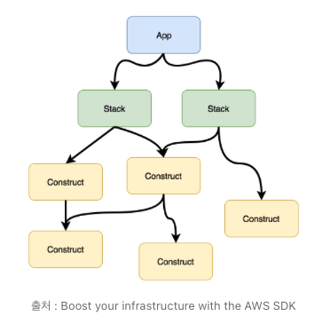

# 재활용 할 수 있는 CDK 모듈 생성하기 - app, context 2편

{: .no_toc }

## Table of contents
{: .no_toc .text-delta }

1. TOC
{:toc}

---

## 글을 쓴 배경

이 글은 AWS CDK를 사용하여 재사용 가능한 모듈 구조를 작성하는 방법을 설명하기 위해 작성되었습니다. 
CDK 앱의 초기화, bin 디렉토리의 역할, 컨텍스트 값의 개념과 사용법을 다룹니다.

## 글 요약

이 글에서는 CDK 프로젝트의 진입점인 app과 context 역할을 설명하고, 어떻게 사용되는지에 대해 다룹니다.

## 시작하기 전

이 글을 읽기 전 [재활용 할 수 있는 CDK 모듈 생성하기](../cdk-module-app)을 우선 읽어주시길 바랍니다.

---

# 프로젝트 구조

```perl
├── README.md
├── bin
│   └── app.ts
├── cdk.context.json
├── cdk.json
├── config
│   └── sample-pattern-config.json
├── infra
│   ├── pattern
│   │   ├── cloudwatch
│   │   │   └── cloudwatch-simple-pattern.ts
│   │   ├── codebuild
│   │   │   ├── codebuild-pol.json
│   │   │   └── codebuild-simple-pattern.ts
│   │   ├── codedeploy
│   │   │   ├── codedeploy-pol.json
│   │   │   └── codedeploy-simple-pattern.ts
│   │   └── s3
│   │       └── s3-check-pattern.ts
│   └── stack
│       ├── cfn-template
│       │   └── sample-cfn-vpc.yaml
│       ├── codebuild
│       │   ├── codebuild-simple-pattern-stack.ts
│       │   ├── codebuild-stack.ts
│       ├── codecommit
│       │   ├── codecommit-stack.d.ts
│       │   └── codecommit-stack.ts
│       ├── codedeploy
│       │   ├── codedeploy-simple-pattern-stack.ts
│       │   └── codedeploy-stack.ts
│       ├── iam
│       │   ├── codebuild-pol.json
│       │   ├── codedeploy-pol.json
│       │   └── iam-stack.ts
│       └── vpc
│           └── sample-cfn-vpc-stack.ts
├── jest.config.js
├── lib
│   ├── app-config.ts
│   ├── app-context.ts
│   └── template
│       ├── common
│       │   ├── common-guardian.ts
│       │   └── common-helper.ts
│       ├── construct
│       │   └── base
│       │       └── base-construct.ts
│       └── stack
│           ├── base
│           │   ├── base-stack.d.ts
│           │   ├── base-stack.js
│           │   ├── base-stack.ts
│           │   ├── cfn-include-stack.d.ts
│           │   ├── cfn-include-stack.js
│           │   ├── cfn-include-stack.ts
│           │   ├── vpc-base-stack.d.ts
│           │   ├── vpc-base-stack.js
│           │   └── vpc-base-stack.ts
├── package-lock.json
├── package.json
├── script
│   ├── db
│   │   └── database_helloworld.sql
│   ├── deploy_stacks.sh
│   ├── destroy_stacks.sh
│   └── setup_initial.sh
├── setup_initial.sh
└── tsconfig.json
```

# CDK APP 이란?



CDK 앱은 하나 이상의 스택으로 구성된 컬렉션을 의미합니다.

앱 인스턴스는 AWS CDK의 `App` 클래스를 사용하여 아래와 같이 생성됩니다.

```typescript
this.cdkApp = new cdk.App();
```

앱 내의 모든 스택과 리소스는 이 클래스의 범위 내에서 정의됩니다.
앱 인스턴스는 초기화 인수가 필요하지 않으며, 앱내의 리소스에 context를 제공합니다. 이렇게 생성된 App 클래스는 자신을 루트로 하는 계층구조를 정의합니다.

앱 내에서 하나 이상의 스택을 인스턴스화 할 수 있고, 스택 내에서 construct를 인스턴스화 하며, construct는 또 다른 construct를 인스턴스화 할 수 있습니다.

이러한 트리구조에서 모든 구문이 서로의 범위 내에 정의되도록하여 구문간의 관계를 명확히 설정하고있습니다.

# CDK Context란?

AWS CDK 앱에서 여러 스택과 리소스 간에 공통적으로 필요한 속성 값이나 메소드를 관리하는데 사용되는 클래스 입니다.

구문간의 관계가 명확히 설정된 환경에서 여러 스택 간에 공통적으로 필요한 값들을 관리하고 사용할 수 있는 컨텍스트가 필요하며, 이를 통해 일관된 환경 설정과 효율적인 리소스 관리를 할 수 있습니다.

그렇다면 이제 어떻게 app 과 context를 활용하는지 알아보겠습니다.

# bin 디렉토리와 app.ts 파일

AWS CDK 프로젝트에서 `bin` 디렉토리는 애플리케이션의 진입점을 정의하는 파일들을 담고 있습니다.
이 디렉토리에는 CDK 앱을 초기화하고 스택을 생성 및 구성하는 코드가 들어 있습니다.

## app.ts 파일의 역할

- **앱 컨텍스트 초기화**: 커스텀 클래스인 `AppContext`를 사용하여 앱의 환경 정보를 초기화합니다.
  - `AppContext` 클래스의 인스턴스를 생성하여 앱의 환경 정보를 초기화합니다.
  - `appConfigFileKey`를 통해 `config`파일이 있는 위치를 찾습니다.
  - `contextArgs`는 런타임에 구성을 동적으로 변경할 수 있는 cdk 명령어 인수입니다.
  - `projectPrefixType은` 프로젝트 접두사의 네이밍 규칙을 결정합니다.

- **스택 생성 및 구성**: CDK 스택을 생성하고 필요한 구성 정보를 전달합니다.
  - `CodeBuildStack`과 `CodeDeployStack` 스택을 생성합니다.
  - 각 스택은 특정 AWS 리소스를 구성하며, `appContext`와 스택에서 사용될 config 정보를 인수로 전달받습니다.

## app.ts 파일 예제

```typescript
import { AppContext, AppContextError } from '../lib/app-context';
import {CodeBuildStack} from "../infra/stack/codebuild/codebuild-stack";
import {CodeDeployStack} from "../infra/stack/codedeploy/codedeploy-stack";

try {

    // 프로젝트의 환경 정보를 구성
    const appContext = new AppContext({
        appConfigFileKey: 'APP_CONFIG',
        contextArgs: ['Stack.SampleVpcEcs.DesiredCount'],
        projectPrefixType: 1
    });

    // 스택 생성 및 구성
    new CodeBuildStack(appContext, appContext.appConfig.Stack.CodeBuildSimplePatternStack)

    new CodeDeployStack(appContext, appContext.appConfig.Stack.CodeDeploySimplePatternStack)
   
} catch (error) {
    if (error instanceof AppContextError) {
        console.error('[AppContextError]:', error.message);
    } else {
        console.error('[Error]: not-handled-error', error);
    }
}
```

## AppContext 클래스와 컨텍스트 관리

앞서 설명한대로 여러 스택 간의 공통적인 설정을 효과적으로 관리하는 것은 중요합니다. 이를 위해 AppContext 클래스와 이를 활용하는 방법에 대해 알아보겠습니다.

아래 `AppContext` 커스텀 클래스는 앱 실행시 가장먼저 실행되며 App 인스턴스를 생성하고, 인수로 전달된 구성 파일을 로드하며, 스택에 필요한 공통 설정을 적용합니다.

`lib/app-context.ts`

```typescript
const fs = require('fs');
const env = require('env-var');
import * as cdk from 'aws-cdk-lib';

import { AppConfig } from './app-config';
import { StackCommonProps } from './template/stack/base/base-stack';

export class AppContextError extends Error {
  constructor(message: string) {
    super(message);
    this.name = "AppConfigFileFailError";
  }
}

export enum ProjectPrefixType {
  NameStage,
  NameHyphenStage,
  Name
}

export interface AppContextProps {
  appConfigFileKey: string;
  contextArgs?: string[];
  projectPrefixType?: ProjectPrefixType;
}

export class AppContext {
    public readonly cdkApp: cdk.App;
    public readonly appConfig: AppConfig;
    public readonly stackCommonProps: StackCommonProps;

    private readonly appContextProps: AppContextProps;

    constructor(props: AppContextProps) {
        this.cdkApp = new cdk.App();
        this.appContextProps = props;

        try {
            const appConfigFile = this.findAppConfigFile(props.appConfigFileKey);
            this.appConfig = this.loadAppConfigFile(appConfigFile, props.contextArgs);

            if (this.appConfig != undefined) {
                this.stackCommonProps = this.createStackCommonProps(appConfigFile);
            }
        } catch (e) {
            console.error(`==> CDK App-Config File is empty, 
            set up your environment variable (Usage: export ${props.appConfigFileKey}=config/app-config-xxx.json) 
            or append inline-argurment (Usage: cdk list --context ${props.appConfigFileKey}=config/app-config-xxx.json)`, e);
            throw new AppContextError('Fail to find App-Config json file');
        }
    }

    // ...
}
```

## 주요 메소드 설명

CDK 애플리케이션의 설정과 환경을 관리하기 위한 다양한 메소드들이 AppContext 클래스에 존재합니다.

```typescript

export class AppContext {
    
    //...

    public ready(): boolean {
        return this.stackCommonProps ? true : false;
    }

    private createStackCommonProps(appConfigFilePath: string): StackCommonProps {

    //...
        return commonStackProps;
    }

    private findAppConfigFile(appConfigKey: string): string {
        //...
        return configFilePath;
    }

    public getProjectPrefix(CompanyCode: string, Environment: string,ServiceCode: string, DetailInfo: string): string {
        //...
        return prefix;
    }

    private applyProjectPrefix(appConfig: any): void {
        //...
    }


    private loadAppConfigFile(filePath: string, contextArgs?: string[]): any {
        //...

        return appConfig;
    }

    private updateContextArgs(appConfig: any, contextArgs: string[]) {
        //...
    }

    private addPrefixIntoResourceName(appConfig: any, projectPrefix: string) {
        //...
    }

    private addSimpleResourceName(appConfig: any) {
        //...
    }
}
```

## createStackCommonProps() 메소드

설정 파일들을 기반으로 `StackCommonProps` 객체를 생성하는 메소드 입니다.

* projectPrefix 생성: `this.getProjectPrefix` 메소드를 호출하여 `appConfig.Project`에 있는 값들을 활용해 `projectPrefix`를 생성합니다.
* appConfig : 지정한 경로에 있는 config 파일을 JSON 객체로 전달된 값
* variables 속성: 빈 객체로 초기화하여 필요한 경우 추가적인 변수를 담기 위해 사용할 수 있습니다.

```typescript
private createStackCommonProps(appConfigFilePath: string): StackCommonProps{
    const commonStackProps: StackCommonProps = {
        projectPrefix: this.getProjectPrefix(this.appConfig.Project.CompanyCode, this.appConfig.Project.Environment, this.appConfig.Project.ServiceCode, this.appConfig.Project.DetailInfo),
        appConfig: this.appConfig,
        appConfigPath: appConfigFilePath,
        env: {
            account: this.appConfig.Project.Account,
            region: this.appConfig.Project.Region
        },
        variables: {}
    }

    return commonStackProps;
}
```


## ready() 메소드

이 메소드는 특정 조건을 확인하여 클래스의 준비 상태를 반환합니다.

* 역할 : stackCommonProps 객체가 올바르게 초기화되어 사용할 준비가 되었는지 여부를 확인합니다.
* 사용 이유 : 다른 코드에서 AppContext 객체를 사용 전 객체가 올바르게 설정되었는지 확인할 수 있는 방법입니다.

```typescript
public ready(): boolean {
    return this.stackCommonProps ? true : false;
}
```

## findAppConfigFile(appConfigKey: string) 메소드

이 메소드는 설정 파일의 경로를 찾습니다.

* 역할: 주어진 키를 이용해 설정 파일의 경로를 찾습니다.
* 사용 이유: 다양한 소스(컨텍스트 값 또는 환경 변수)를 통해 전달된 설정 파일의 경로를 로드할 수 있도록 합니다.

Node.js에서 제공하는 env-var 패키지를 사용하여 지정된 환경변수 키 값을 이용해 설정 파일의 경로를 가져올 수 있습니다.
또한, CDK 명령어 인수로 설정 파일의 경로를 제공할 수도 있습니다.

```typescript
private findAppConfigFile(appConfigKey: string): string {
    let fromType = 'InLine-Argument';
    let configFilePath = this.cdkApp.node.tryGetContext(appConfigKey); // CDK 컨텍스트에서 경로를 검색

    if (configFilePath == undefined) {
        configFilePath = env.get(appConfigKey).asString(); // 환경 변수에서 경로를 검색

        if (configFilePath != undefined && configFilePath.length > 0) {
            fromType = 'Environment-Variable'; // 환경 변수에서 값을 찾은 경우 출처를 변경
        } else {
            configFilePath = undefined; // 값을 찾지 못한 경우 경로를 undefined로 설정

        }
    }

    if (configFilePath == undefined) {
        throw new Error('Fail to find App-Config json file');  // 경로를 찾지 못한 경우 오류 발생
    } else {
        console.info(`==> CDK App-Config File is ${configFilePath}, which is from ${fromType}.`);  // 경로와 출처를 로그로 출력
    }

    return configFilePath;
}
```

**참고 : 컨텍스트 값 설정 방법 ( 설정파일 전달 방법 )**

1. cdk.json 파일

```json
{
  "context": {
    "APP_CONFIG": "path/to/config.json"
  }
}
```

2. 명령줄 인수

```sh
cdk deploy --context APP_CONFIG=path/to/config.json
```

## getProjectPrefix(appConfigKey: string) 메소드

프로젝트 접두사를 생성합니다.

* 역할: 주어진 프로젝트 정보를 바탕으로 프로젝트 접두사를 생성합니다.
* 사용 이유: 스택 리소스 명명 규칙에 따라 일관된 접두사를 생성하여 리소스를 관리하기 쉽게 만듭니다. `ProjectPrefixType` 따라 다른 `prefix`를 제공할 수 있습니다.

```typescript
public getProjectPrefix(CompanyCode: string, Environment: string, ServiceCode: string, DetailInfo: string): string {
    let prefix = `${CompanyCode}${Environment}${ServiceCode}${DetailInfo}`;

    if (this.appContextProps.projectPrefixType === ProjectPrefixType.NameHyphenStage) {
        prefix = `${CompanyCode}-${Environment}-${ServiceCode}-${DetailInfo}`;
    } else if (this.appContextProps.projectPrefixType === ProjectPrefixType.Name) {
        prefix = ServiceCode;
    }

    return prefix;
}
```

## applyProjectPrefixToStack(appConfig: any): void 메소드

주어진 AppConfig 객체의 스택 리소스 이름에 프로젝트 접두사를 적용합니다.

* 역할: 주어진 프로젝트 접두사를 이용해 이를 스택 리소스에 적용하여 일관된 명명 규칙을 따르도록 합니다.

* 사용 이유: 프로젝트의 스택 명칭에 일관되고 유일한 접두사를 부여함으로써, 리소스 관리 및 식별을 용이하게 합니다.

```typescript
private applyProjectPrefixToStack(appConfig: any): void {
   // getProjectPrefixProps 메소드를 사용하여 appConfig에서 필요한 속성들을 가져와서 getProjectPrefix 메소드에 전달
   const prefix = this.getProjectPrefix(this.getProjectPrefixProps(appConfig));

   // appConfig.Stack 객체의 모든 키에 대해 반복
   Object.keys(appConfig.Stack).forEach(key => {

      // 스택 명칭은 별도로 설정
      appConfig.Stack[key].StackName = `${prefix}-${appConfig.Stack[key].StackName}`;
   });
}
```

## loadAppConfigFile(filePath: string, contextArgs?: string[]): any 메소드

주어진 파일 경로에서 앱 구성 파일을 로드하고, 필요에 따라 컨텍스트 인자를 업데이트하며, 스택 이름에 프로젝트 접두사를 추가합니다.

* 역할 : 앱 구성파일을 로드하여 JSON 객체로 파싱합니다.
* 사용 이유 : JSON 객체로 파싱된 앱 구성파일을 이용해 실제 스택 리소스를 배포하기 위해 사용됩니다. 

```typescript
private loadAppConfigFile(filePath: string, contextArgs?: string[]): any {
    // 파일 경로에서 앱 구성 파일을 읽어와 JSON 객체로 파싱
    let appConfig = JSON.parse(fs.readFileSync(filePath).toString());

    // 프로젝트 접두사를 생성
    let projectPrefix = this.getProjectPrefix(this.getProjectPrefixProps(appConfig.Project));

    // 컨텍스트 인자가 정의된 경우, 앱 구성에 반영
    if (contextArgs != undefined) {
        this.updateContextArgs(appConfig, contextArgs);
    }

    // 리소스 이름에 프로젝트 접두사를 추가
    this.addPrefixIntoResourceName(appConfig, projectPrefix);

    return appConfig;
}
```

## updateContextArgs(appConfig: any, contextArgs: string[]) 메소드

주어진 컨텍스트 인자를 앱 구성에 업데이트합니다.

* 역할: 컨텍스트 인자에 따라 앱 구성 파일의 값을 업데이트합니다.

* 사용 이유: CDK 앱의 컨텍스트에서 가져온 값을 앱 구성 파일에 반영하여 동적으로 값을 변경할 수 있게 합니다.

```typescript
private updateContextArgs(appConfig: any, contextArgs: string[]) {
    for (let key of contextArgs) {
        const jsonKeys = key.split('.');
        let oldValue = undefined;
        const newValue: string = this.cdkApp.node.tryGetContext(key);

        if (newValue != undefined && jsonKeys.length > 0) {
            try {
                // 기존 값을 찾아서 oldValue에 저장
                oldValue = jsonKeys.reduce((reducer: any, pointer: string) => reducer.hasOwnProperty(pointer) ? reducer[pointer] : undefined, appConfig);
            } catch (e) {
                console.error(`[ERROR] updateContextArgs: This key[${key}] is an undefined value in Json-Config file.\n`, e);
                throw e;
            }

            // 새로운 값을 설정
            jsonKeys.reduce((reducer: any, pointer: string, count: number) => {
                if (count == jsonKeys.length - 1) reducer[pointer] = newValue;
                return reducer[pointer];
            }, appConfig);

            console.info(`[INFO] updateContextArgs: Updated ${key} = ${oldValue}-->${newValue}`);
        }
    }
}
```

**코드 상세 설명**

이 코드는 reduce 함수를 사용하여 중첩된 JSON 객체 내에서 새로운 값을 설정합니다. 

reduce 함수는 배열의 각 요소에 대해 누적 연산을 수행하는데, 이때 누적 값을 유지하기 위한 변수를 reducer라고 합니다.

reduce 함수의 기본 구조는 다음과 같습니다. callback은 배열의 각 요소에 대해 호출되는 함수입니다.

```typescript
array.reduce(callback, initialValue)
```

현재 호출된 내용을 보면 초기값으로 appConfig가 제공되어있습니다.
```typescript
oldValue = jsonKeys.reduce((reducer: any, pointer: string) => reducer.hasOwnProperty(pointer) ? reducer[pointer] : undefined, appConfig);
```

만약 contextArgs 값으로 ['Stack.CodeDeployStack.StackName'] 값이 넘어왔다면

최종적으로 oldValue는 appConfig['Stack']['CodeDeploySimplePatternStack']['StackName']의 값을 가지게 됩니다.


## addPrefixIntoResourceName(appConfig: any, projectPrefix: string) 메소드

주어진 앱 구성 객체의 스택 리소스 이름에 프로젝트 접두사를 추가합니다.

```typescript
private addPrefixIntoResourceName(appConfig: any, projectPrefix: string) {
   for (const key in appConfig.Stack) {
      const stackOriginalName = appConfig.Stack[key].StackName;
      appConfig.Stack[key].ShortStackName = stackOriginalName;
      appConfig.Stack[key].StackNameWithPrifix = `${projectPrefix}-${stackOriginalName}`;
   }
}
```

# Context 사용

* 명령줄 인수: cdk deploy --context key=value 명령을 통해 전달.
* 환경 변수: export key=value 명령을 통해 설정.
* cdk.json: 파일 내 직접 설정.

이렇게 설정된 컨텍스트 값은 CDK 애플리케이션의 실행 중에 필요한 다양한 설정을 동적으로 제공하며, 
일관된 환경 설정과 효율적인 리소스 관리를 가능하게 합니다.


