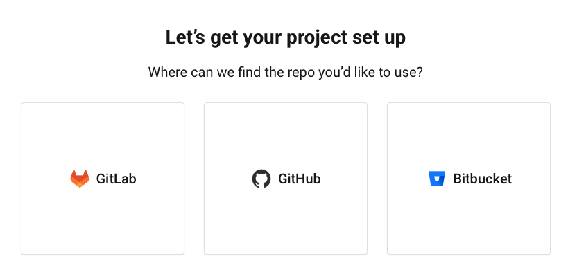
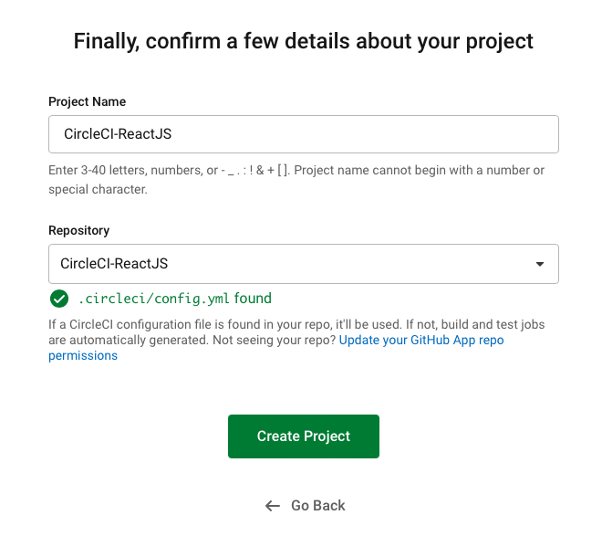
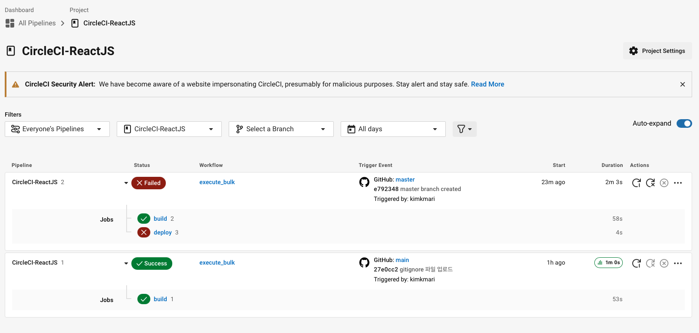
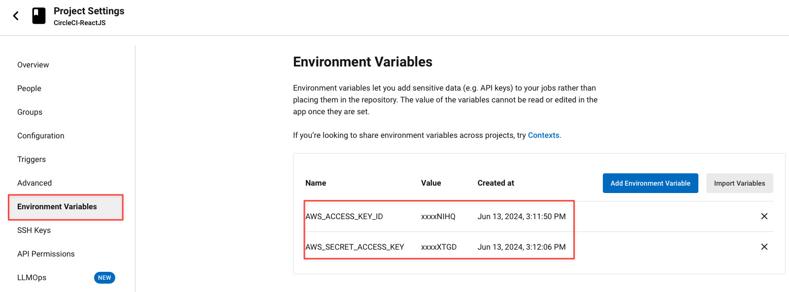
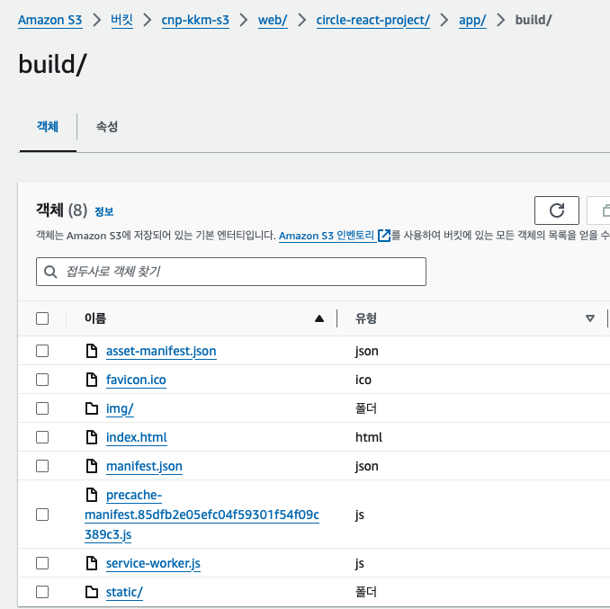
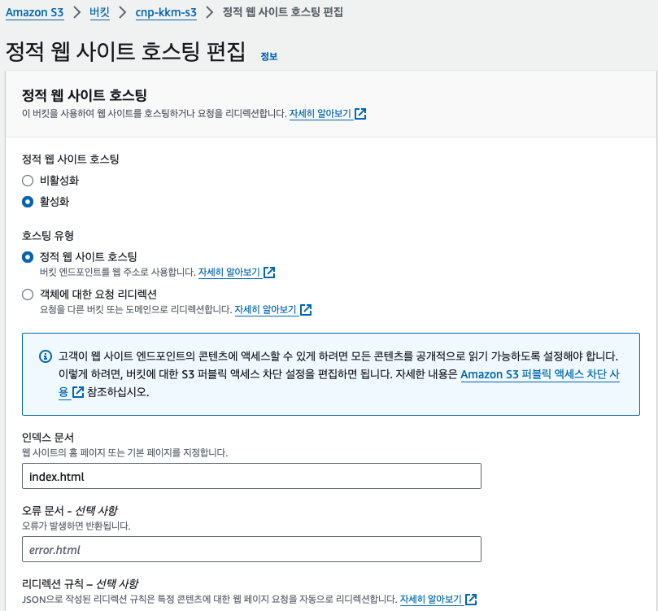
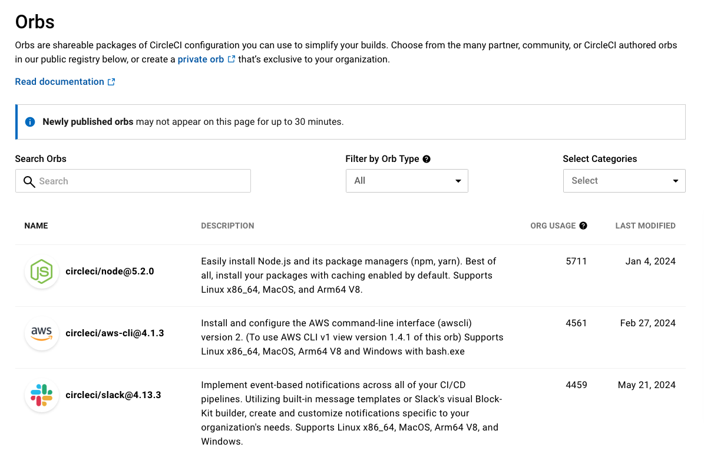
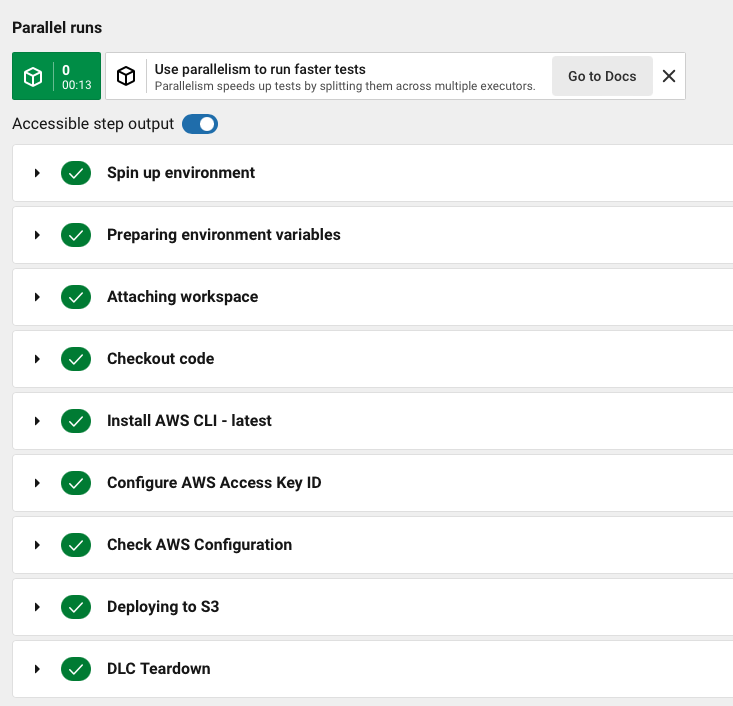
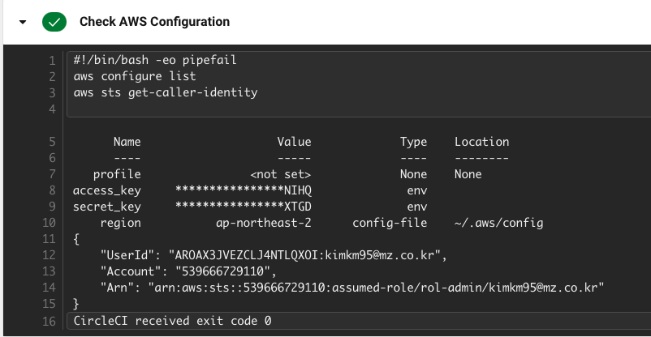

# Circle CI
{: .no_toc }

## 목차
{: .no_toc .text-delta }

1. TOC
{:toc}

---

## 글을 쓴 배경

표준화 부족,레거시 기술의 복잡성,비효율적인 수작업 등이 엔터프라이즈 환경의 문제점으로 지적되었습니다.

이를 해결하기 위해 개발자 플랫폼을 통해 표준화된 도구와 기술 스택 제공의 필요성이 대두되었습니다.

이에 따라 CircleCI를 CI/CD 도구로 선택하고 가이드를 작성하게 되었습니다.

참고 연설 : [Platform as Code: Simplifying developer platform design with reference architectures](https://www.youtube.com/watch?v=AimSwK8Mw-U)

## 글 요약

이 가이드에서는 CI/CD 프로세스 자동화를 위한 구성 파일과 Orbs를 통한 써드 파티 통합을 설명하며, 최종적으로 정적 웹페이지 어플리케이션을 구성하는 방법을 소개합니다.


## 시작하기 전

* GitHub 계정
* CircleCI 계정

## 1. CircleCI의 주요 기능

1. **자동화**: 코드의 빌드, 테스트, 배포 전체 CI/CD 프로세스를 자동화합니다. 
2. **커스터마이징**: YAML 파일을 통해 작업, 워크플로우, 단계를 구성하여 프로젝트 요구사항에 맞게 커스터마이징할 수 있습니다. 
3. **Orbs**: 타사 도구 및 서비스와의 통합을 간소화하는 재사용 가능한 YAML 구성 패키지입니다. 
4. **병렬 처리**: 여러 작업을 병렬로 실행하여 CI/CD 파이프라인을 가속화할 수 있습니다. 
5. **SSH 디버깅**: SSH를 사용하여 작업을 다시 실행할 수 있어 심층 디버깅이 가능합니다.
6. **환경 유연성**: 다양한 운영 체제 및 커스텀 Docker 이미지를 지원하여 빌드 환경의 유연성을 제공합니다.

## 2. CircleCI 사용

### 2.1 지원되는 Git Repository

1. GitLab
2. GitHub
3. Bitbucket



### 2.2 프로젝트 추가

CircleCI 대시보드에서 배포할 저장소를 선택한 후 프로젝트를 추가할 수 있습니다.



참고 코드 : https://github.com/AmanPathak-DevOps/CircleCI-ReactJS.git

### 2.3 구성 파일 생성

repository에 `.circleci` 폴더를 생성하고 `config.yml` 파일을 추가하세요.

**기본 구성 예시**

Node.js 가 포함된 도커 이미지환경에서 코드를 체크아웃하고, 종속성을 설치하는 구성 파일입니다.

```yaml
version: 2.1
jobs:
  build:
    docker:
      - image: circleci/node:latest
    steps:
      - checkout
      - run:
          name: Install Dependencies
          command: npm install
      - run:
          name: Run Tests
          command: npm test

workflows:
  version: 2
  build_and_test:
    jobs:
      - build
```

**CircleCI 구성 추가 예시**

특정 브랜치의 변경 사항을 AWS S3 버킷에 배포하는 과정을 자동화 한 구성 파일입니다.

```yaml
version: 2.1
jobs:
  # Builing the project is going to start
  build:
    # working_directory: ~/repo
    machine:
      image: ubuntu-2004:202010-01
      docker_layer_caching: true
    steps:
      - checkout
      #      - run:
      #          name: Installing 02_AWS CLI
      #          command: |
      #            sudo apt-get update
      #            sudo apt install python3-pip
      #            sudo pip3 install awsebcli --upgrade
      - run: cd ./app && npm install && npm run build
      - persist_to_workspace:
          root: .
          paths:
            - .

  # Deploying the code to 02_AWS S3 Bucket
  deploy:
    # working_directory: ~/repo
    machine:
      image: ubuntu-2004:202010-01
      docker_layer_caching: true
    steps:
      - attach_workspace:
          at: .
      - checkout
      - run:
          name: Check Env
          command: |
            echo "AWS_ACCESS_KEY_ID: $AWS_ACCESS_KEY_ID"
            echo "AWS_SECRET_ACCESS_KEY: $AWS_SECRET_ACCESS_KEY"
      - run:
          name: Configuring 02_AWS
          command: |
            aws configure set aws_access_key_id $AWS_ACCESS_KEY_ID
            aws configure set aws_secret_access_key $AWS_SECRET_ACCESS_KEY
            aws configure set default.region ap-northeast-2
      - run:
          name: Deploying to S3
          command: |
            if [ $CIRCLE_BRANCH = 'master' ]; then
              aws s3 sync ./app/build s3://kkm-s3/
            fi

workflows:
  version: 2
  execute_bulk:
    jobs:
      - build
      - deploy:
          requires:
            - build
          filters:
            branches:
              only:
                - master
```

### 2.4 구성 파일 상세 설명

#### 2.4.1 Jobs

* jobs 섹션은 CircleCI에서 실행할 개별 작업을 정의합니다. 각 작업을 통해 빌드, 테스트, 배포등의 작업을 수행할 수 있습니다.

#### 2.4.2 Build

* 빌드 작업을 실행할 이미지를 지정할 수 있습니다.
* `docker_layer_caching: true`옵션을 통해 Docker 레이어 캐싱을 활성화하여 빌드 속도를 높일 수 있습니다.

```yaml
  build:
    # working_directory: ~/repo
    machine:
      image: ubuntu-2004:202010-01
      docker_layer_caching: true
```

* steps 를 통해 작업에서 수행할 단계 목록을 정의할 수 있습니다.
* 어플리케이션 디렉토리로 이동하여 종속성을 설치하고 빌드합니다.

```yaml
  build:
    steps:
      - checkout
      - run: cd ./app && npm install && npm run build
      - persist_to_workspace:
          root: .
          paths:
            - .
```

* `persist_to_workspace` 빌드 결과를 작업 공간에 저장하여 이후 작업에서 사용할 수 있도록 합니다.
* 현재 구성에서는 빌드 결과가 포함된 모든 파일과 디렉토리가 다음 step에서 사용될 수 있도록 저장된다는 의미입니다.

```yaml
      - persist_to_workspace:
          root: .
          paths:
            - .
```

#### 2.4.3 Deploy

* deploy step에서 빌드 결과를 AWS S3 버킷에 배포하는 작업을 수행합니다.
* `attach_workspace`를 통해 이전 작업의 작업 공간을 연결하여 빌드 결과를 사용할 수 있습니다.

```yaml
    steps:
      - attach_workspace:
          at: .
      - checkout
      - run: 
          name: Configuring 02_AWS
          command: |
            if [ $CIRCLE_BRANCH = 'master' ]; then
              aws s3 sync ./app/build s3://kkm-s3/
            fi

```

#### 2.4.4 workflows

* 여러 작업을 조합하여 빌드 파이프라인을 정의할 수 있습니다.
* workflow 하위의 `execute_bulk`는 단순 워크 플로우 이름입니다.
* 빌드 작업 실행 후 deploy 작업이 실행됩니다. deploy 작업은 오직 master 브랜치에서만 실행되도록 필터링 되어있습니다.

```yaml
workflows:
  version: 2
  execute_bulk:
    jobs:
      - build
      - deploy:
          requires:
            - build
          filters:
            branches:
              only:
                - master
```

#### 2.4.5 CircleCI 콘솔 확인

master 브랜치에 push 했을 때는 deploy 작업이 추가로 수행된 것을 확인할 수 있습니다.



#### 2.4.6 CircleCI에서 AWS 자격증명 설정하기

프로젝트 설정의 환경 변수 부분에서 AWS 자격증명을 등록해줍니다.



#### 2.4.7 deploy 결과 s3에서 확인하기



#### 2.4.8 S3 버킷 웹페이지 활성화하기

* s3 버킷 내에 정적 웹 사이트 호스팅을 활성화 합니다.
* 버킷 퍼블릭 액세스를 허용합니다.
* ACL 없이 공개 접근을 허용합니다.
* 버킷 정책을 수정합니다.



#### 2.4.9 실제 웹페이지 확인


### 3. Orbs 사용하기

Orbs는 CircleCI의 독특한 기능으로, 써드 파티 도구와의 통합을 쉽게 할 수 있는 재사용 가능한 YAML 구성 패키지입니다.

#### 3.1 Orbs 사용 이유

**프로젝트 구성 시간 절약**: 반복적인 설정 작업을 단순화하여 프로젝트 구성 시간을 줄여줍니다.
**효율성 증가**: 여러 프로젝트에서 공통으로 사용하는 설정을 Orbs로 정의하여 효율성을 높입니다.
**써드 파티 통합 간소화**: Orbs를 사용하면 다양한 써드 파티 도구와의 통합이 쉬워집니다.

#### 3.2 Orbs 사용 방법

**기존 Orbs 사용**: [CircleCI Orbs 레지스트리](https://circleci.com/developer/orbs)에서 원하는 Orbs의 설정 코드를 복사하여 사용합니다.
**Orbs 직접 생성**: 필요에 맞는 Orbs가 없는 경우, [CircleCI의 베스트 프랙티스와 시작 가이드](https://circleci.com/docs/orb-development-kit/)를 참고하여 직접 Orbs를 생성할 수 있습니다.

#### 3.3 사용할 수 있는 Orbs 예시

* Slack
* AWS
* Microsoft
* Atlassian

**CircleCI Orbs 레지스트리 화면**



#### 3.4 aws orbs 적용

관련 orbs 문서 : [Orbs/circleci/aws-cli@4.1.3](https://circleci.com/developer/orbs/orb/circleci/aws-cli)

```yaml
version: 2.1

orbs:
  aws-cli: circleci/aws-cli@4.1.3

jobs:
  # Builing the project is going to start
  build:
    # working_directory: ~/repo
    machine:
      image: ubuntu-2004:202010-01
      docker_layer_caching: true
    steps:
      - checkout
      - run: cd ./app && npm install && npm run build
      - persist_to_workspace:
          root: .
          paths:
            - .

  # Deploying the code to 02_AWS S3 Bucket
  deploy:
    # working_directory: ~/repo
    machine:
      image: ubuntu-2004:202010-01
      docker_layer_caching: true
    steps:
      - attach_workspace:
          at: .
      - checkout
      - aws-cli/setup:
          profile_name: mzc-pops-cnp
          aws_access_key_id: AWS_ACCESS_KEY_ID
          aws_secret_access_key: AWS_SECRET_ACCESS_KEY
          region: ap-northeast-2
      - run:
          name: Check 02_AWS Configuration
          command: |
            aws configure list
            aws sts get-caller-identity
      - run:
          name: Deploying to S3
          command: |
            if [ $CIRCLE_BRANCH = 'master' ]; then
              aws s3 sync ./app/build s3://web-bucket-kkm/
            fi

workflows:
  version: 2
  execute_bulk:
    jobs:
      - build
      - deploy:
          requires:
            - build
          filters:
            branches:
              only:
                - master
```

#### 3.5 aws orbs 배포 확인

* aws orbs를 사용하면 AWS CLI 를 설치하고 aws configure을 간소화 할 수 있습니다.



* aws configuration 적용된 모습

