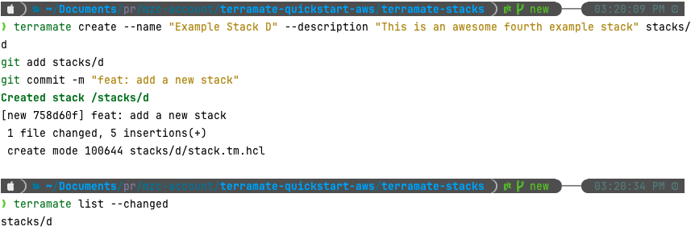
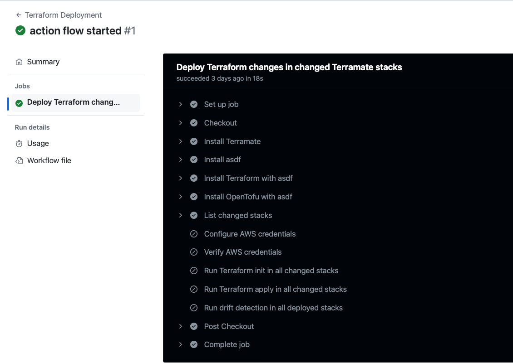

# Terramate 
{: .no_toc }

## Table of contents
{: .no_toc .text-delta }

1. TOC
{:toc}

---

## 글을 쓴 배경

표준화 부족, 레거시 기술의 복잡성, 높은 인지 부담, 비효율적인 수작업 등이 엔터프라이즈 환경의 문제점으로 지적되었습니다.

이를 해결하기 위해 개발자 플랫폼을 통해 표준화된 도구와 기술 스택을 제공하여 개발자 경험과 생산성을 향상시키는 것이 중요한 과제로 제시되었습니다.

이에 따라 IaC관리 플랫폼인 Terramate 사용법을 작성해보았습니다.

참고 연설 : [Platform as Code: Simplifying developer platform design with reference architectures](https://www.youtube.com/watch?v=AimSwK8Mw-U)

## 글 요약

이 글에서는 Terramate를 사용하여 Terraform 스택을 생성, 관리 및 오케스트레이션하는 방법을 다룹니다. 
각 스택에 Terraform 구성을 추가하고, 변경 사항을 감지하여 효율적으로 스택을 관리하는 방법을 설명합니다.

git action flow와 통합하여 자동화된 배포 파이프라인을 구성해봅니다.

기존 사용하고 있는 프로젝트 코드와 통합해 봅니다.

## 시작하기 전

github action 기본 지식 필요
terramate version : 0.8.4
terraform version : v1.8.5


# Terramate 소개

Terramate는 IaC 관리 플랫폼으로, 팀이 Terraform, OpenTofu, Terragrunt, Kubernetes 등과 같은 
IaC 도구를 사용하여 클라우드 인프라를 구축, 배포, 관리 및 모니터링을 할 수 있도록 돕습니다. 

Terramate는 무료 오픈 소스 CLI를 제공하며, 이를 Terramate Cloud와 통합할 수도 있습니다.

Terramate는 기존 아키텍처에 사전 요구 사항이나 기존 Terraform 구성을 수정할 필요 없이 단 한 번의 명령어로 온보딩할 수 있습니다.

# Terramate Stack이란?

스택은 Terraform과 OpenTofu를 단위별로 관리할 수 있도록 합니다. 
스택 별로 독립적인 배포 및 관리를 가능하게 하여 병렬 처리로 실행 시간을 줄이고 
변경된 스택만 업데이트하여 전체 인프라에 영향을 최소화할 수 있습니다.

스택은 특정 서비스를 배포하는 데 필요한 리소스의 번들이며, 스택을 묶어서 다양한 환경에 배포할 수 있습니다. 스택의 구성요소는 다음과 같습니다:

1. 인프라 코드: Terraform의 .tf 파일를 사용하여 인프라 리소스와 구성을 선언합니다.
2. 상태: terraform.tfstate 파일을 통해 배포된 현재 인프라 상태를 설명합니다.
3. 구성: stack.tm.hcl 을 통해 스택 동작 및 구성을 정의합니다.

# Terramate Stack 생성하기

참조 자료 : [Create and orchestrate Terraform Stacks with Terramate](https://medium.com/terramate/create-and-orchestrate-terraform-stacks-with-terramate-6a2197fb5c28)

**새로운 저장소 생성**

```shell
git init -b main terramate-stacks
cd terramate-stacks
```

**샘플 스택 생성**

* 스택을 생성하면 `stack.tm.hcl` 파일이 생성됩니다. 이 파일들은 해당 디렉토리를 Terramate 스택으로 식별하기 위한 식별자 역할을 합니다.


```shell
terramate create --name "Example Stack A" --description "This is an awesome first example stack" stacks/a
terramate create --name "Example Stack B" --description "This is an awesome second example stack" stacks/b
terramate create --name "Example Stack C" --description "This is an awesome third example stack" stacks/c
```

**명령어를 실행 한 후 stack.tm.hcl 샘플 파일 확인**

```yaml
stack {
  name        = "Example Stack A"
  description = "This is an awesome first example stack"
  id          = "e834b046-980e-47ce-9118-1bf56034aa73"
}
```

**스택 메타데이터 확인**

* 메타 데이터 확인 명령어 : `terramate debug show metadata`

```yaml
project metadata:
        terramate.stacks.list=[/stacks/a /stacks/b /stacks/c]

stack "/stacks/a":
        terramate.stack.id="e834b046-980e-47ce-9118-1bf56034aa73"
        terramate.stack.name="Example Stack A"
        terramate.stack.description="This is an awesome first example stack"
        terramate.stack.tags=[]
        terramate.stack.path.absolute="/stacks/a"
        terramate.stack.path.basename="a"
        terramate.stack.path.relative="stacks/a"
        terramate.stack.path.to_root="../.."
```

# Terramate Orchestration

현재 생성된 각 스택 디렉토리에 main.tf를 생성하고 terramate를 통해 테라폼 오케스트레이션 테스트를 진행합니다.

아래는 테스트용 terraform code를 stack 에 넣는 예시 명령어 입니다. `null_resource`를 사용하여 테스트를 실행해도 별다른 배포가 이루어지지 않습니다.

```yaml
echo 'resource "null_resource" "stack" {}' | tee stacks/a/main.tf stacks/b/main.tf stacks/c/main.tf > /dev/null
```

## Terramate Orchestration 명령어

* terramate를 이용해서 terraform 코드를 아래와 같이 배포할 수 있습니다.

`terramate run terraform init`

`terramate run terraform apply`

## Terramate를 이용한 stack 실행 순서 사용자 지정

스택별 기본 실행 순서를 명시적으로 변경할 수 있습니다. Terramate의 before-and-after 구성을 사용하여 스택의 오케스트레이션 동작을 구성할 수 있습니다.

**실행 순서 적용전** a 배포 후 b 배포 실행

```console
❯ terramate run terraform apply
terramate: Entering stack in /stacks/a
terramate: Executing command "terraform apply"

...

null_resource.stack: Creating...
null_resource.stack: Creation complete after 0s [id=8860708672716908454]

Apply complete! Resources: 1 added, 0 changed, 0 destroyed.

terramate: Entering stack in /stacks/b
terramate: Executing command "terraform apply"

...

null_resource.stack: Creating...
null_resource.stack: Creation complete after 0s [id=7369955017342757335]
```

**실행 순서 적용 후**

* `stack/a/stack.tm.hcl` 파일을 다음과 같이 수정합니다

```yaml
stack {
  name        = "Example Stack A"
  description = "This is an awesome first example stack"
  id          = "e834b046-980e-47ce-9118-1bf56034aa73"
  after       = [
        "../b"
    ]
}
```

**결과 화면**

* 실행 순서가 b -> a로 변한 것을 확인할 수 있습니다.

```console
terramate: Entering stack in /stacks/b
terramate: Executing command "terraform apply"

...

null_resource.stack: Creating...
null_resource.stack: Creation complete after 0s [id=4049987914117276811]

Apply complete! Resources: 1 added, 0 changed, 0 destroyed.
terramate: Entering stack in /stacks/a
terramate: Executing command "terraform apply"

...

null_resource.stack: Creating...
null_resource.stack: Creation complete after 0s [id=1256199023530115670]

Apply complete! Resources: 1 added, 0 changed, 0 destroyed.
```

## Terramate 중첩 스택

Terramate 스택은 중첩될 수 있어, 인프라 코드를 트리 형태로 구성할 수 있습니다. 
마찬가지로 중첩된 스택에서도 명시적 스택 순서를 적용할 수 있습니다.

## 변경된 스택 감지

Terramate는 Git 레포지토리 변경 사항을 기반으로 변경된 스택을 감지하여 감지된 스택만 배포할 수 있습니다.



`changed` 옵션을 통해 변경이 일어난 스택을 감지하고 해당 스택만 배포할 수 있습니다.


## 병렬 실행

Terramate는 병렬 실행을 지원하여 여러 스택에서 명령어를 병렬적으로 실행할 수 있습니다.

명령어 : `terramate run --parallel=3 terraform apply -auto-approve`

# GitHub Action 이용해서 Terramate를 이용한 배포 파이프라인 구성하기

참조 코드 : [terramate-quickstart-aws](https://github.com/kimkmari/terramate-quickstart-aws.git)

참조 문서 : [Introducing the Terramate GitHub Action](https://medium.com/terramate/introducing-the-terramate-github-action-6dc84dbdc7d0)

Terramate를 GitHub Actions 워크플로우에 통합하는 것이 GitHub Marketplace의 Terramate Action 도입으로 더욱 쉬워졌습니다. 이제 수동 설치의 번거로움은 잊고 효율적인 인프라 관리를 시작하세요.

## GitHub에 Terraform 코드 업로드

Terraform 코드를 GitHub 레포지토리에 업로드 하여 GitHub에서 제공하는 workflow를 이용하여 terramate를 관리할 것입니다.

## Terramate 설치

GitHub Actions를 사용하여 Terramate CLI를 자동으로 설치 할 수 있습니다. 이를 위해 .github/workflows 디렉토리에 워크플로우 파일을 생성합니다.

참고자료 : https://medium.com/terramate

.github/workflows/terramate-setup.yml
```yaml
name: Terramate Action Tests

on:
  push:
    branches:
      - main
  pull_request:

defaults:
  run:
    shell: bash

jobs:
  simple:
    name: Terramate latest
    runs-on: ubuntu-latest
    steps:
      - name: Checkout
        uses: actions/checkout@v4

      - name: Install latest Terramate
        uses: ./

      - name: Validate execution
        run: terramate version

  asdf:
    name: Terramate asdf
    runs-on: ubuntu-latest
    strategy:
      matrix:
        version: [0.4.2, 0.4.3, skip]
    steps:
      - name: Checkout
        uses: actions/checkout@v4

      - name: Prepare asdf config
        if: ${{ matrix.version != 'skip' }}
        run: echo "terramate ${{ matrix.version}}" >.tool-versions

      - name: Prepare empty asdf config
        if: ${{ matrix.version == 'skip' }}
        run: echo >.tool-versions

      - name: Install asdf Terramate
        uses: ./

      - name: Validate execution
        run: terramate version

      - name: Validate version - ${{ matrix.version }}
        id: version
        if: ${{ matrix.version != 'skip' }}
        run: terramate version | grep ${{ matrix.version }}

      - name: Validate outputs - ${{ matrix.version }}
        if: ${{ matrix.version != 'skip' }}
        run: echo "${{ steps.version.outputs.stdout }}" | grep ${{ matrix.version }}


  wrapper:
    name: Terramate with wrapper
    runs-on: ubuntu-latest
    strategy:
      matrix:
        version: [0.4.3, latest]
    steps:
      - name: Checkout
        uses: actions/checkout@v4

      - name: Install Terramate Wrapper - ${{ matrix.version }}
        uses: ./
        with:
          version: ${{ matrix.version }}

      - name: Validate execution - ${{ matrix.version }}
        run: terramate version

      - name: Validate version - ${{ matrix.version }}
        id: version
        if: ${{ matrix.version != 'latest' }}
        run: terramate version | grep ${{ matrix.version }}

      - name: Validate outputs - ${{ matrix.version }}
        if: ${{ matrix.version != 'latest' }}
        run: echo "${{ steps.version.outputs.stdout }}" | grep ${{ matrix.version }}
```

## Github Action workflows 파일 상세 설명

위 workflows 파일에서는 terramate를 설치하는 다양한 방법들을 jobs 별로 정의해두었습니다.

**Job 1: simple**
* `Install latest Terramate`: 최신 버전의 Terramate를 설치합니다.
* `Validate execution`: Terramate가 올바르게 설치되었는지 버전을 확인합니다.

**Job 2: asdf**

asdf는 버전 관리 도구입니다. 이 도구는 .tool-versions 파일을 통해 원하는 버전을 지정하고 필요에 따라 해당 버전을 설치하고 사용하게 합니다.
* `Install asdf Terramate`: asdf를 사용하여 Terramate를 설치합니다.
* `Validate execution`: Terramate가 올바르게 설치되었는지 버전을 확인합니다.
* `Validate version`: 특정 버전이 올바르게 설치되었는지 검증합니다.
* `Validate outputs`: 설치된 버전의 출력 결과를 검증합니다.

**Job 3: wrapper**

wrapper는 Terramate 명령어를 감싸는 스크립트로, GitHub Actions 실행 환경에서 Terramate 명령어의 실행 결과를 후속 작업에서 사용할 수 있도록 도와줍니다.

* `Install Terramate Wrapper`: 지정된 버전의 Terramate를 설치하고 래퍼 스크립트를 사용합니다.
* `Validate execution`: Terramate가 올바르게 설치되었는지 버전을 확인합니다.
* `Validate version`: 특정 버전이 올바르게 설치되었는지 검증합니다.
* `Validate outputs`: 설치된 버전의 출력 결과를 검증합니다.

## Github Action 파이프라인 확인

GitHub Actions을 통해 Terramate가 잘 배포되었는지 확인합니다. 각 단계별로 Terramate 버전과 실행 결과를 검증합니다.



## Github Actions 통합의미

Terramate GitHub Action을 활용하면 일관된 환경을 유지 할 수 있으며 코드 변경이 있을 때마다 자동으로 테스트되고 배포될 수 있습니다. 여러 명의 팀과 함께 협업할때 stack관리측면에서 유용합니다. 